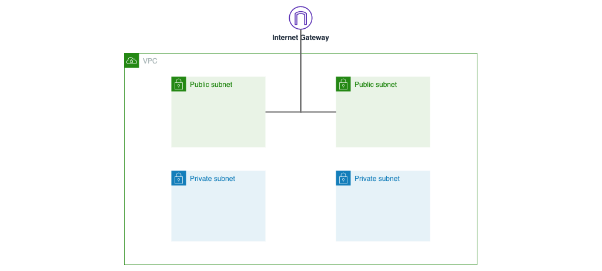
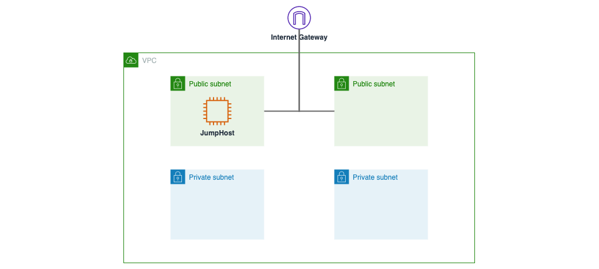

# CloudFormation Tutorial - How To Automate EC2 Instance In 5 Mins

This repository contains examples automation of the article [CloudFormation Tutorial - How To Automate EC2 Instance In 5 Mins](https://hanes-on.cloud/cloudformation-tutorial-how-to-automate-ec2-instance-in-5-mins/)

## VPC

[cloudformation-vpc.yaml](./cloudformation-vpc.yaml)

## EC2

[cloudformation-ec2.yaml](./cloudformation-ec2.yaml)

