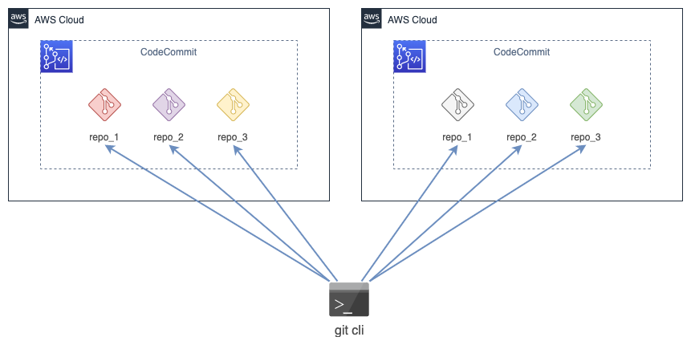

In this article I’ll show, how you can coonect and commit to multiple CodeCommit repositories in different AWS account from the same machine in easy and comfortable way.

## Prerequisites

* One or more AWS users with access to different CodeCommit repositories
* `awscli` tool installed
* `git` tool installed
* You're using Linux or OS X

## Credentials

First of all we need to setup profile for `awscli` utility for each AWS account for each organization

```sh
vim ~/.aws/credentials
```

Here's the example structure to create profiles `my_organization_account_1` and `my_organization_account_2` for your accounts:

```ini
[my_organization_account_1]
region = us-east-2
aws_access_key_id = YOUR_AWS_ACCESS_KEY_FOR_ACCOUNT_1
aws_secret_access_key = YOUR_AWS_SECRET_ACCESS_KEY_FOR_ACCOUNT_1

[my_organization_account_2]
region = us-east-1
aws_access_key_id = YOUR_AWS_ACCESS_KEY_FOR_ACCOUNT_2
aws_secret_access_key = YOUR_AWS_SECRET_ACCESS_KEY_FOR_ACCOUNT_2
```

## Connect to repository

As soon as profiles been set up, we can connect and clone CodeCommit repositories. Let's assume repository `repo_1` belongs to your first account described profile `my_organization_account_1`. 

Create empty directory for this repository

```sh
cd folder/with/projects
mkdir repo_1
```

Now, we can use `aws codecommit credential-helper` to with `--profile` argument to let `git` connect to CodeCommit repository in your first account. And we're using `git config --local` to specify configuration only for `repo_1` git repository in the first account.

```sh
cd repo_1
git init
git config --local credential.helper '!aws codecommit credential-helper --profile my_organization_account_1 $@'
git config --local credential.UseHttpPath true
```

And lastly, all we need to do is to add remote CodeCommit repository location (copy your URL from CodeCommit Web console) and clone our project

```sh
git remote add origin https://git-codecommit.us-east-2.amazonaws.com/v1/repos/my_repository
git pull origin master
```

Hope, that will save you some time and efforts. 
