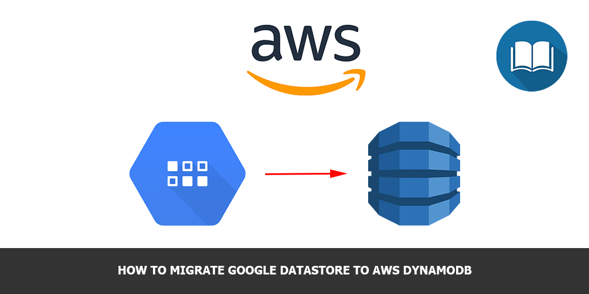

In this small post I’ll show you how you can migrate Google DataStore kind to AWS DynamoDB table.

## Virtual environment

```sh
virtualenv venv
source venv/bin/activate
pip install boto3
pip install google-cloud-datastore
```

## Migration process

First of all we’ll need to get DataStore data:

```python
from google.cloud import datastore

datastore_client = datastore.Client()
query = datastore.Query(datastore_client, kind='MyKind')

ds_results = []
for result in query.fetch():
    ds_results.append(result)
```

After that we need to connect to our DynamoDB table:

```python
import boto3
import json
import decimal
from boto3.dynamodb.conditions import Key, Attr

# Helper class to convert a DynamoDB item to JSON.
class DecimalEncoder(json.JSONEncoder):
    def default(self, o):
        if isinstance(o, decimal.Decimal):
            if o % 1 > 0:
                return float(o)
            else:
                return int(o)
        return super(DecimalEncoder, self).default(o)

boto3.setup_default_session(profile_name='my_aws_connection_profile')
dynamodb = boto3.resource('dynamodb', region_name='us-east-1')

table = dynamodb.Table('MyTable')
```

And finally we need to make a migration.

To make everything’s happen we need:

- convert GCP DataStore Entity to JSON representation
- remove keys with possible empty values
- send and item to DynamoDB

```python
for item in ds_results:
    i = json.loads(json.dumps(item))
    i = dict((k, v) for k, v in i.iteritems() if v)
    table.put_item(
        Item=i
    )
```

Hope, this will save somebody’s time!
