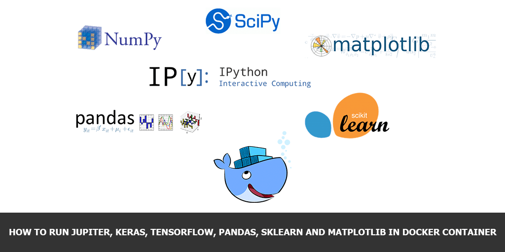

Environment setup is a very common question when you’re trying to start learning Machine Learning (ML). In this article I’ll show you how to create your own Docker container including the following frameworks for comfortable start:

- [Python 3](https://www.python.org/)
- [Jupyter](http://jupyter.org/)
- [Keras](https://keras.io/)
- [Tensorflow](https://www.tensorflow.org/)
- [TensorBoard](https://www.tensorflow.org/guide/summaries_and_tensorboard)
- [Pandas](https://pandas.pydata.org/)
- [Sklearn](http://scikit-learn.org/stable/)
- [Matplotlib](https://matplotlib.org/)
- [Seaborn](https://seaborn.pydata.org/)
- [pyyaml](https://pypi.python.org/pypi/PyYAML)
- [h5py](http://www.h5py.org/)

That are TOP 10 widely used Python frameworks for Data Science and you’ll find most of them in any HOWTO article on the Internet. In the nex article ([How to build Python Data Science Docker container based on Anaconda](how-to-build-python-data-science-docker-container-based-on-anaconda)) I'll show how to build the same image, but on top of Anaconda distribution.

## Requirements

All you need to have is [Docker](https://www.docker.com/) and text editor installed on your system.

## Dockerfile

All you need to do, is to create a project folder and file named `Dockerfile` inside:

```sh
mkdir python_data_science_container
cd python_data_science_container
vim Dockerfile
```

After that put the following content to the `Dockerfile`:

```docker
FROM ubuntu:16.04 as opencv-builder
MAINTAINER "Andrei Maksimov"

RUN apt-get update && apt-get install -y wget ca-certificates \
    build-essential cmake pkg-config \
    libjpeg8-dev libtiff5-dev libjasper-dev libpng12-dev \
    libavcodec-dev libavformat-dev libswscale-dev libv4l-dev \
    libxvidcore-dev libx264-dev \
    libgtk-3-dev \
    libatlas-base-dev gfortran \
    git curl vim python3-dev python3-pip \
    libfreetype6-dev libhdf5-dev && \
    rm -rf /var/lib/apt/lists/*

RUN wget -O opencv.tar.gz https://github.com/opencv/opencv/archive/3.3.1.tar.gz && \
    tar zxvf opencv.tar.gz && \
    wget -O opencv_contrib.tar.gz https://github.com/opencv/opencv_contrib/archive/3.3.1.tar.gz && \
    tar zxvf opencv_contrib.tar.gz

RUN cd opencv-3.3.1 && \
    mkdir build && \
    cd build && \
    cmake -D CMAKE_BUILD_TYPE=RELEASE \
        -D CMAKE_INSTALL_PREFIX=/usr/local \
        -D INSTALL_PYTHON_EXAMPLES=ON \
        -D INSTALL_C_EXAMPLES=OFF \
        -D OPENCV_EXTRA_MODULES_PATH=../../opencv_contrib-3.3.1/modules \
        -D BUILD_EXAMPLES=ON .. && \
    make -j4 && \
    make install && \
    ldconfig && \
    cd / && rm -Rf /opencv-3.3.1 /opencv_contrib-3.3.1

RUN pip3 install tensorflow && \
    pip3 install numpy pandas sklearn matplotlib seaborn jupyter pyyaml h5py && \
    pip3 install keras --no-deps && \
    pip3 install opencv-python && \
    pip3 install imutils

RUN ["mkdir", "notebooks"]
COPY conf/.jupyter /root/.jupyter
COPY run_jupyter.sh /

# Jupyter and Tensorboard ports
EXPOSE 8888 6006

# Store notebooks in this mounted directory
VOLUME /notebooks

CMD ["/run_jupyter.sh"]
```

You may find always up-to-date example of my own [Dockerfile](https://github.com/andreivmaksimov/python_data_science/blob/master/Dockerfile) on GitHub, which I use to [create my personal](https://travis-ci.org/andreivmaksimov/python_data_science) Data Science container environment (it is also available on [Docker Hub](https://hub.docker.com/r/amaksimov/python_data_science/) for free).

## Jupyter configuration

As soon as we declared our container and it’s components, it’s time to prepare a configuration for Jupyter. Create a file [jupyter_notebook_config.py](https://github.com/andreivmaksimov/python_data_science/blob/master/jupyter_notebook_config.py) with the following content:

```python
c = get_config()  # get the config object
c.IPKernelApp.pylab = 'inline'  # in-line figure when using Matplotlib
c.NotebookApp.ip = '*'
c.NotebookApp.allow_remote_access = True
c.NotebookApp.open_browser = False  # do not open a browser window by default when using notebooks
c.NotebookApp.token = '' # No token. Always use jupyter over ssh tunnel
c.NotebookApp.notebook_dir = '/notebooks'
c.NotebookApp.allow_root = True # Allow to run Jupyter from root user inside Docker container
```

As you can guess from `Dockerfile`, we’ll put it to `/root/.jupyter/` folder during container build process.

## Creating startup script

The last thing we need to do is to create a script, which will launch Jupiter server inside our container during it’s starting process. Create a with the following content:

```sh
#!/usr/bin/env bash

jupyter notebook "$@"
```

And make this file executable:

```sh
chmod +x run_jupyter.sh
```

This file will be launched inside your container by default each time you’ll start the new one.

## Creating container image

The last stage – container creation. Just run the following command to build your Docker container from the project directory:

```sh
docker build -f Dockerfile -t python_data_science_container
```

During build process Docker will install all necessary libraries and frameworks inside your container image and make it available for use.

## Running container

Now you have a working container and it’s time to start it. Create a folder inside your project’s folder where we’ll store all our Jupyter Noteboos with source code of our projects:

```sh
mkdir notebooks
```

And start the container with the following command:

```sh
docker run -it -p 8888:8888 -p 6006:6006 -d -v $(pwd)/notebooks:/notebooks python_data_science_container
```

It will start the container and expose Jupyter on port `8888` and Tensorflow Dashboard on port `6006` on your local computer or your server depending on where you’re executed this command.

**Please be aware that this container was created only for local development purpose and I removed authentication on Jupyter in this container, so everybody can connect to port 8888 or 6006 and execute Python code of cause.**

## If you're just looking for a working solution

If you don’t want to create and maintain your own container and aforesaid components will be sufficient for you, please feel free to use my personal container, that I usually update:

```sh
docker run -it -p 8888:8888 -p 6006:6006 -d -v $(pwd)/notebooks:/notebooks amaksimov/python_data_science
```

Hope, this article will be helpful for you. If you like the article, please repost it using any social media you’d like. See you soon!
