Yesterday I decided to test [Serverless framework](https://serverless.com/) and rewrite AWS "[Build a Serverless Web Application with AWS Lambda, Amazon API Gateway, Amazon S3, Amazon DynamoDB, and Amazon Cognito](https://aws.amazon.com/getting-started/projects/build-serverless-web-app-lambda-apigateway-s3-dynamodb-cognito/)" tutorial.

In this tutorial we’ll deploy the same [Wild Rides](http://www.wildrydes.com/) web application, but will do it in fully automated manner.

You can find full configuration and code in my [GitHub repo](https://github.com/andreivmaksimov/serverless-framework-aws-lambda-amazon-api-gateway-s3-dynamodb-and-cognito). Use tag v1.0 for this article.

In [part 2](/serverless-framework-building-web-app-using-aws-lambda-amazon-api-gateway-s-3-dynamo-db-and-cognito-part-2) of this post you’ll find how to replace API Gateway resources created in this article to Serverless framework `events`.

## Application architecture

Sure, to allow you to see all details in the same place, we need to copy some content from the original tutorial. So, our app will consist of:

- **Static Web Hosting** – Amazon S3 hosts static web resources including HTML, CSS, JavaScript, and image files which are loaded in the user’s browser.
- **User Management** – Amazon Cognito provides user management and authentication functions to secure the backend API.
- **Serverless Backend** – Amazon DynamoDB provides a persistence layer where data can be stored by the API’s Lambda function.
- **RESTful API** – JavaScript executed in the browser sends and receives data from a public backend API built using Lambda and API Gateway.

I’ll keep the same modules structure for consistency:

- Static Web Hosting
- User Management
- Serverless Backend
- RESTful APIs
- Resource Termination and Next Steps

## Project setup

First of all, if you do not have Serverless framework installed, please, follow their Quick Start guide. As soon as Serverless framework installed, we’re ready to start. Let’s create project directory and create a Serverless project template:

```sh
mkdir wild-rides-serverless-demo
cd wild-rides-serverless-demo
sls create -t aws-nodejs -n wild-rides-serverless-demo
```

At this moment of time you’ll see two file inside our project directory:

- `handler.js` – this file contains demo Lambda function code
- `serverless.yaml` – this file contains Serverless project deployment configuration

Before continue this tutorial I strongly recommend to spend 30 minutes on looking through Serverless framework AWS [documentation](https://serverless.com/framework/docs/providers/aws/guide/).

## Static web hosting

In this module we’ll configure Amazon Simple Storage Service (S3) to host the static resources for our web application. In subsequent modules we’ll add dynamic functionality to these pages using JavaScript to call remote RESTful APIs built with AWS Lambda and Amazon API Gateway.

## Create S3 bucket

To do so, first let’s uncomment `resources:` section of the `serverless.yaml` file and change the name of [S3 bucket](https://docs.aws.amazon.com/AWSCloudFormation/latest/UserGuide/aws-properties-s3-bucket.html) to something like `wildrydes-firstname-lastname` (because S3 buckets must be globally unique). Also I changed `NewResource:` CloudFormation resource name to `WildRydesBucket`.

```yaml
resources:
  Resources:
    WildRydesBucket:
      Type: AWS::S3::Bucket
      Properties:
        BucketName: wildrydes-andrei-maksimov
```

Let’s deploy this part of our stack:

```sh
sls deploy
```

This command will deploy demo lambda function, which was created by Serverless framework by default, and create our S3 bucket.

## Upload static content

To upload Wild Rides website static content to our S3 bucket, we need to clone aws-serverless-workshops repository:

```sh
git clone https://github.com/awslabs/aws-serverless-workshops/
```

Now we can copy website content:

```sh
aws s3 sync ./aws-serverless-workshops/WebApplication/1_StaticWebHosting/website s3://wildrydes-firstname-lastname
```

Right after that we may need to delete aws-serverless-workshops from our project:

```sh
rm -Rf ./aws-serverless-workshops
```


## Add bucket policy to allow public reads

Now we need to specify [S3 bucket policy](https://docs.aws.amazon.com/AWSCloudFormation/latest/UserGuide/aws-properties-s3-policy.html). To do so, add the following content to `resources:` section of `serverless.yaml` file:

```yaml
WildRydesBucketPolicy:
  Type: AWS::S3::BucketPolicy
  Properties:
    Bucket:
      Ref: 'WildRydesBucket'
    PolicyDocument:
      Statement:
        - Effect: 'Allow'
          Principal: '*'
          Action:
            - 's3:GetObject'
          Resource:
            Fn::Join:
              - ''
              - - 'arn:aws:s3:::'
                - Ref: 'WildRydesBucket'
                - '/*'
```

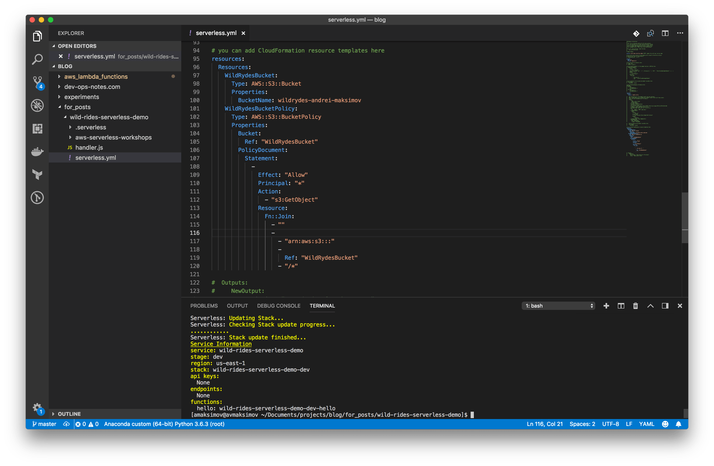

Deploy your changes:

```sh
sls deploy
```

## Enable static website hosting

As soon as we specified right bucket policy, we need to enable static website hosting for our bucket. To do so, we need to add `WebsiteConfiguration:` to our `WildRydesBucket:` resource declaration:

```yaml
  WebsiteConfiguration:
    IndexDocument: index.html
To display bucket website URL, uncomment the Outputs: section and add the following code there:

    WildRydesBucketURL:
      Description: "Wild Rydes Bucket Website URL"
      Value:
        "Fn::GetAtt": [ WildRydesBucket, WebsiteURL ]
```


Let’s redeploy the changes and test that static website is now accessible:

```sh
sls deploy
```

To display CloudFormation stack outputs run the following command:

```sh
sls info --verbose
```

You may open your website URL in the browser to check, that everything’s deployed as expected:

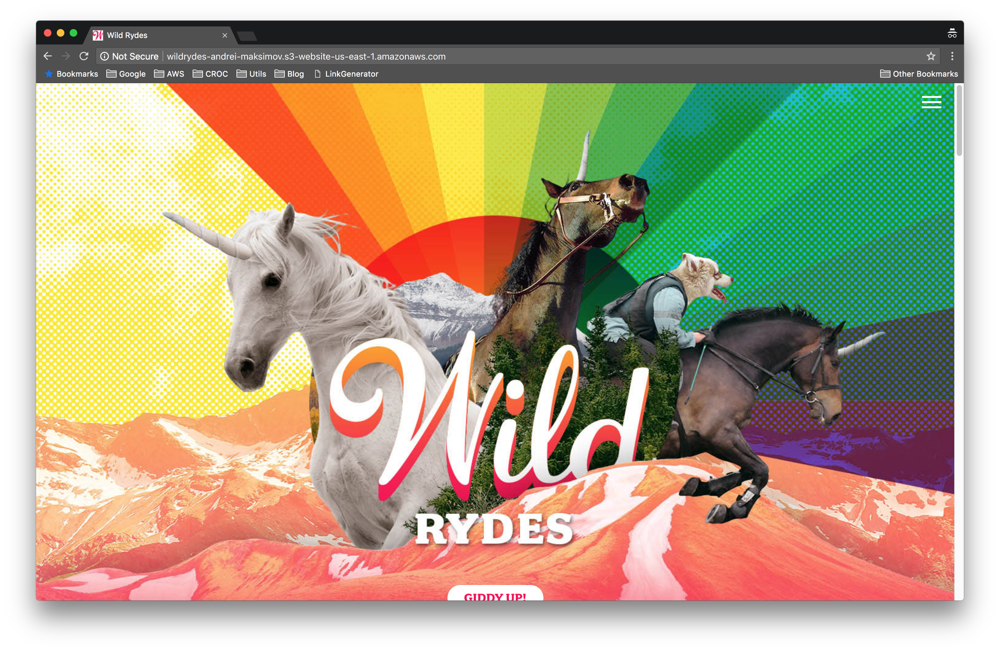

## User management

In this module we’ll create an Amazon Cognito user pool to manage our users’ accounts. We’ll also deploy pages that enable customers to register as a new user, verify their email address, and sign into the site.

After users submit their registration, Amazon Cognito will send a confirmation email with a verification code to the address they provided. To confirm their account, users will return to your site and enter their email address and the verification code they received.

After users have a confirmed account (either using the email verification process or a manual confirmation through the console), they will be able to sign in. When users sign in, they enter their username (or email) and password. A JavaScript function then communicates with Amazon Cognito, authenticates using the Secure Remote Password protocol (SRP), and receives back a set of JSON Web Tokens (JWT). The JWTs contain claims about the identity of the user and will be used in the next module to authenticate against the RESTful API you build with Amazon API Gateway.

## Create AWS Cognito user pool

Amazon Cognito provides two different mechanisms for authenticating users:

- we can use Cognito User Pools to add sign-up and sign-in functionality to your application or use Cognito Identity Pools to authenticate users through social identity providers such as Facebook, Twitter, or Amazon, with SAML identity solutions
- we can use our own identity system.

Here we’ll use a user pool as the backend for the provided registration and sign-in pages. First, let’s create [Cognito User Pool](https://docs.aws.amazon.com/AWSCloudFormation/latest/UserGuide/aws-resource-cognito-userpool.html) by adding it’s declaration to `resources:` section of our `serverless.yaml` file:

```yaml
WildRydesCognitoUserPool:
  Type: AWS::Cognito::UserPool
  Properties:
    UserPoolName: WildRydes
```


Let’s deploy our changes:

```sh
sls deploy
```

## Add app to your user pool

Next, we need to create [Cognito User Pool Client](https://docs.aws.amazon.com/AWSCloudFormation/latest/UserGuide/aws-resource-cognito-userpoolclient.html). I do not understand, why they call it App Client in web console. To do so, as usual, we need to add new resource to resource: section in serverless.yaml file:

```yaml
WildRydesCognitoUserPoolClient:
  Type: AWS::Cognito::UserPoolClient
  Properties:
    ClientName: WildRydesWebApp
    GenerateSecret: false
    UserPoolId:
      Ref: 'WildRydesCognitoUserPool'
```


Let’s deploy our changes:

```sh
sls deploy
```

## Update config.js file in your website bucket

In this section of AWS tutorial they’re asking us to make changes in `js/config.js` file. More over, we’ll need `userPoolId` and `userPoolClientId`. As we’re not using web console, let’s request them as `Outputs:` in our `serverless.yaml` file:

```yaml
WildRydesCognitoUserPoolId:
  Description: 'Wild Rydes Cognito User Pool ID'
  Value:
    Ref: 'WildRydesCognitoUserPool'
WildRydesCognitoUserPoolClientId:
  Description: 'Wild Rydes Cognito User Pool Client ID'
  Value:
    Ref: 'WildRydesCognitoUserPoolClient'
```

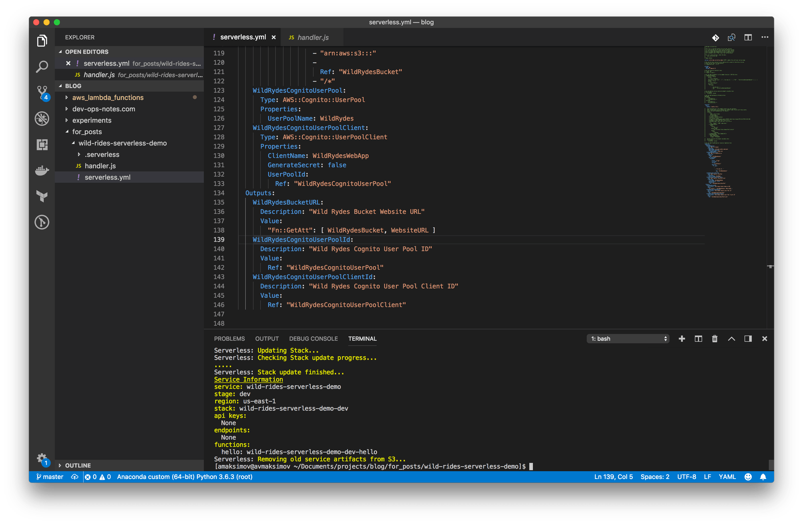

Now we need to redeploy our changes:

```sh
sls deploy
```

And display IDs:

```sh
sls info --verbose
```

Now we’re ready to make changes in the `js/config.js` file. First of all let’s download it:

```sh
aws s3 cp s3://wildrydes-firstname-lastname/js/config.js ./
```

After that, fill `userPoolId`, `userPoolClientId` and `region` (all this information available from `sls info --verbose` command):


Save the file and upload it back:

```sh
aws s3 cp ./config.js s3://wildrydes-firstname-lastname/js/config.js
```

## Validate your implementation

Now we’re ready to validate our Cognito configuration. I’ll not copy-paste it from AWS tutorial. Here’s the [link](https://aws.amazon.com/getting-started/projects/build-serverless-web-app-lambda-apigateway-s3-dynamodb-cognito/module-2/). You need last step and manual user verification. It means, when you’ll register new user:


You need to go to AWS console (Services – Cognito – WildRydes – Users and groups menu):


And confirm registered user manually (click on the user and use **Confirm user** button):


After user confirmation, we’re able to login using `/signin.html` page where we will be redirected to `/ride.html`:

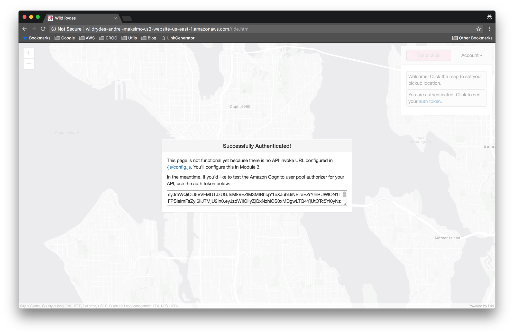

## Serverless service backend

In this module we’ll use AWS Lambda and Amazon DynamoDB to build a backend process for handling requests for your web application. The browser application that you deployed in the previous step allows users to request that a unicorn be sent to a location of their choice. In order to fulfill those requests, the JavaScript running in the browser will need to invoke a service running in the cloud.

You’ll implement a Lambda function that will be invoked each time a user requests a unicorn. The function will select a unicorn from the fleet, record the request in a DynamoDB table and then respond to the front-end application with details about the unicorn being dispatched.

The function is invoked from the browser using Amazon API Gateway.

## Create AWS DynamoDB table

As in the original tutorial we’ll call your table `Rides` and give it a partition key called `RideId` with type String. To do so, we need to add the [DynamoDB](https://docs.aws.amazon.com/AWSCloudFormation/latest/UserGuide/aws-resource-dynamodb-table.html) resource to `resources:` section of `serverless.yaml` file:

```yaml
WildRydesDynamoDBTable:
  Type: AWS::DynamoDB::Table
  Properties:
    TableName: Rides
    AttributeDefinitions:
      - AttributeName: RideId
        AttributeType: S
    KeySchema:
      - AttributeName: RideId
        KeyType: HASH
    ProvisionedThroughput:
      ReadCapacityUnits: 5
      WriteCapacityUnits: 5
```

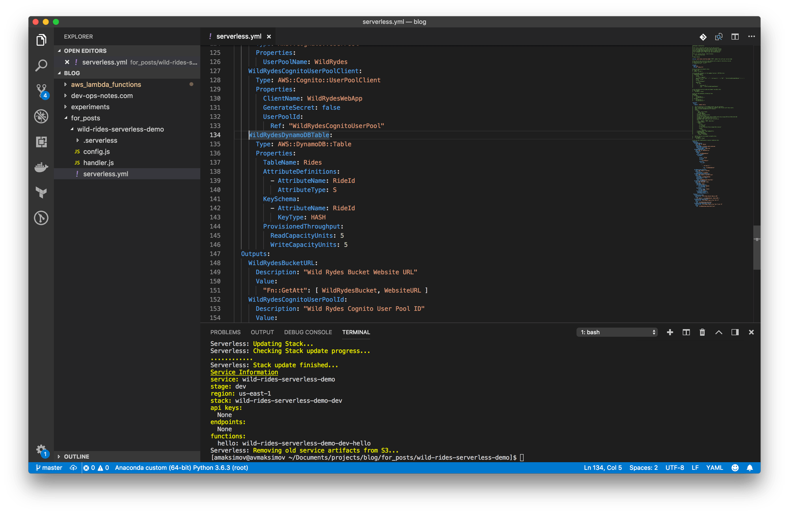

And of cause we need to redeploy our stack:

```sh
sls deploy
```

Finally, we need to get DynamoDB **ARN**. And you already know how to do it. In the `Outputs:` of `resources:` section in `serverless.yaml` file we need to add the following:

```yaml
WildRydesDynamoDbARN:
  Description: 'Wild Rydes DynamoDB ARN'
  Value:
    'Fn::GetAtt': [WildRydesDynamoDBTable, Arn]
```

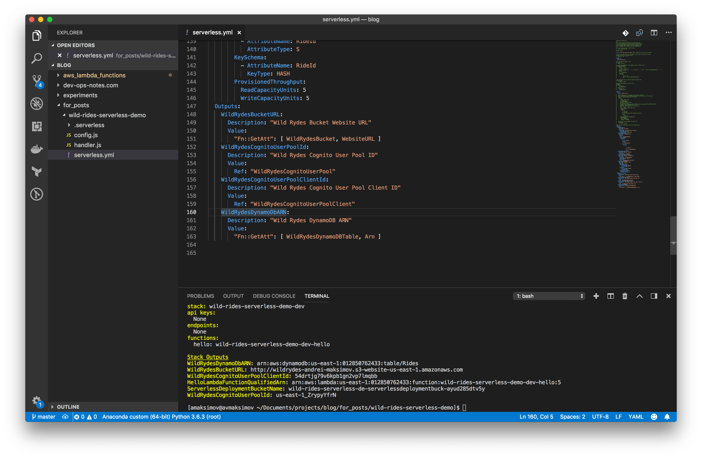

## Create IAM role for Lambda runction

Every Lambda function has an IAM role associated with it. This role defines what other AWS services the function is allowed to interact with. For the purposes of this tutorial, you’ll need to create an IAM role that grants your Lambda function permission to write logs to Amazon CloudWatch Logs and access to write items to your DynamoDB table.

To do so we need to create Lambda function IAM Role and assign it with a policy:

```yaml
WildRydesLambdaRole:
  Type: AWS::IAM::Role
  Properties:
    RoleName: WildRydesLambda
    AssumeRolePolicyDocument:
      Version: '2012-10-17'
      Statement:
        - Effect: Allow
          Principal:
            Service:
              - lambda.amazonaws.com
          Action: sts:AssumeRole
    Policies:
      - PolicyName: DynamoDBWriteAccess
        PolicyDocument:
          Version: '2012-10-17'
          Statement:
            - Effect: Allow
              Action:
                - logs:CreateLogGroup
                - logs:CreateLogStream
                - logs:PutLogEvents
              Resource:
                - 'Fn::Join':
                    - ':'
                    - - 'arn:aws:logs'
                      - Ref: 'AWS::Region'
                      - Ref: 'AWS::AccountId'
                      - 'log-group:/aws/lambda/*:*:*'
            - Effect: Allow
              Action:
                - dynamodb:PutItem
              Resource:
                'Fn::GetAtt': [WildRydesDynamoDBTable, Arn]
```

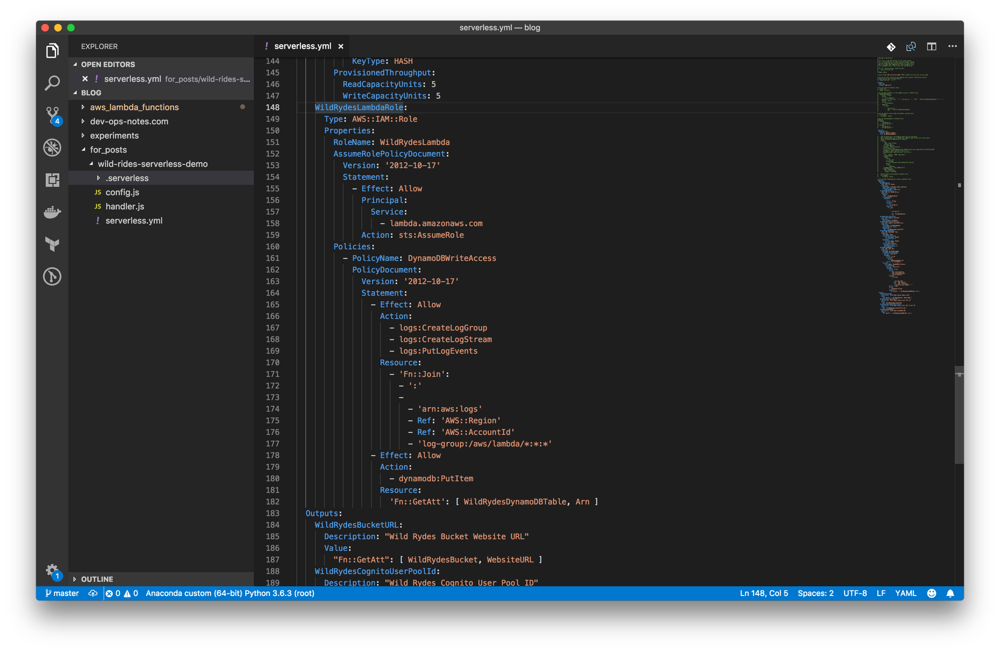

You may redeploy our stack, if you want to:

```sh
sls deploy
```

## Create Lambda function for handling requests

Woohoo! It’s time to create a our Lambda function and grant it with appropriate privileges to have access to our DynamoDB! Let’s start from the Lambda function itself. Yes, we’re changing original tutorial order a little bit and create Lambda function first. In the next section, I’ll show you, how you can easily attach necessary permissions.

AWS Lambda will run your code in response to events such as an HTTP request. In this step you’ll build the core function that will process API requests from the web application to dispatch a unicorn. In the following steps you’ll use Amazon API Gateway to create a RESTful API that will expose an HTTP endpoint that can be invoked from your users’ browsers. You’ll then connect the Lambda function you create in this step to that API in order to create a fully functional backend for your web application.

But right now let’s create Lambda function called `RequestUnicorn` that will process the API requests. First of all we need to declare it in `functions:` section in `serverless.yaml` file (replace hello function):

```yaml
functions:
  RequestUnicorn:
    handler: handler.handler
    role: WildRydesLambdaRole
```

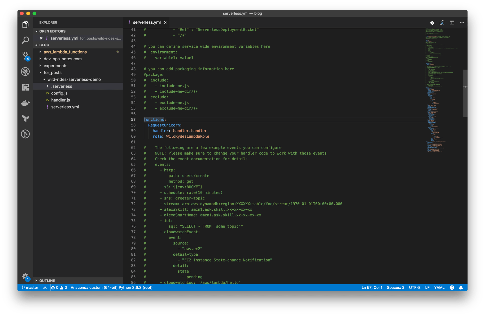

This will tell Serverless framework to create our function with appropriate name and specified entry point. Please, take a look under `handler:` declaration. First `handler` specifies the filename where to look our function content. The second `handler` is the name of exported function to call each time Lambda function is triggered.

Now we need to change the code of our lambda function. Open `handler.js` file and replace everything with a provided [requestUnicorn.js](https://github.com/awslabs/aws-serverless-workshops/blob/master/WebApplication/3_ServerlessBackend/requestUnicorn.js) code example as it is.

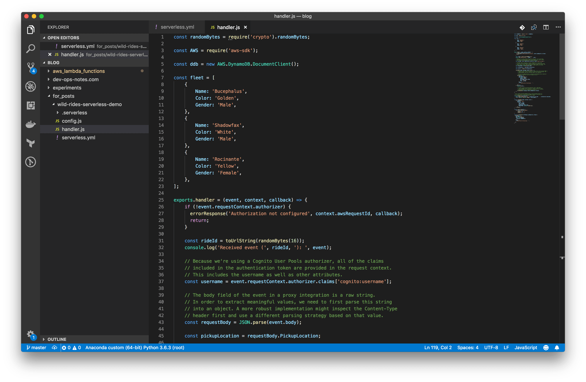

Now it is definitely a time to redeploy our stack:

```sh
sls deploy
```

## Validate your implementation

To validate our current service implementation we need to follow official instructions from AWS tutorial. Let’s open our Lambda function in AWS console. As you can see, it has permissions to access to CloudWatch and DynamoDB.


Let’s create a test by clicking **Test** button. Fill the form as it shown below:


Test name is `TestRequestEvent`. Test message body:

```json
{
  "path": "/ride",
  "httpMethod": "POST",
  "headers": {
    "Accept": "*/*",
    "Authorization": "eyJraWQiOiJLTzRVMWZs",
    "content-type": "application/json; charset=UTF-8"
  },
  "queryStringParameters": null,
  "pathParameters": null,
  "requestContext": {
    "authorizer": {
      "claims": {
        "cognito:username": "the_username"
      }
    }
  },
  "body": "{\"PickupLocation\":{\"Latitude\":47.6174755835663,\"Longitude\":-122.28837066650185}}"
}
```

Click **Create** button to create test.

Click **Test** button once more again to see successful test results:

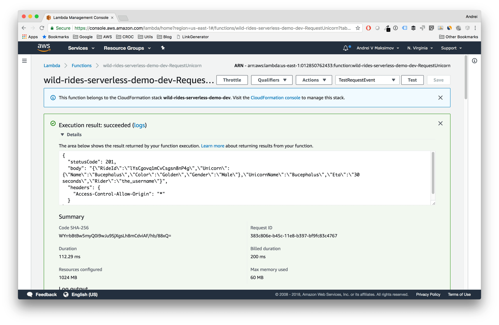

## Restful APIs

Now it’s time to use [Amazon API Gateway](https://docs.aws.amazon.com/AWSCloudFormation/latest/UserGuide/aws-resource-apigateway-restapi.html) to expose the Lambda function you built in the previous steps as a RESTful API. This API will be accessible on the public Internet. It will be secured using the Amazon Cognito user pool you created in the previously. Using this configuration you will then turn your statically hosted website into a dynamic web application by adding client-side JavaScript that makes AJAX calls to the exposed APIs.

The static website you deployed in the first steps already has a page configured to interact with the API you’ll build in this module. The page at `/ride.html` has a simple map-based interface for requesting a unicorn ride. After authenticating using the `/signin.html` page, your users will be able to select their pickup location by clicking a point on the map and then requesting a ride by choosing the “Request Unicorn” button in the upper right corner.

## Create new REST API

All we need to do now – is to specify [Amazon API Gateway REST API](https://docs.aws.amazon.com/AWSCloudFormation/latest/UserGuide/aws-resource-apigateway-restapi.html) resource:

```yaml
WildRydesApiGatewayRestApi:
  Type: AWS::ApiGateway::RestApi
  Properties:
    Name: WildRydes
    EndpointConfiguration:
      Types:
        - EDGE
```


Redeploy your stack to get AWS Api Gateway up and running.

```sh
sls deploy
```

## Create Cognito user pools authorizer

Amazon API Gateway can use the JWT tokens returned by Cognito User Pools to authenticate API calls. In this step you’ll configure an authorizer for your API to use the user pool you created earlier. First of all we need to create [ApiGateway Authorizer](https://docs.aws.amazon.com/AWSCloudFormation/latest/UserGuide/aws-resource-apigateway-authorizer.html) in our `resources:` section in `serverless.yaml` file:

```yaml
WildRydesApiGatewayAuthorizer:
  Type: AWS::ApiGateway::Authorizer
  Properties:
    Name: WildRydes
    RestApiId:
      Ref: WildRydesApiGatewayRestApi
    Type: COGNITO_USER_POOLS
    ProviderARNs:
      - Fn::GetAtt: [WildRydesCognitoUserPool, Arn]
    IdentitySource: method.request.header.Authorization
```

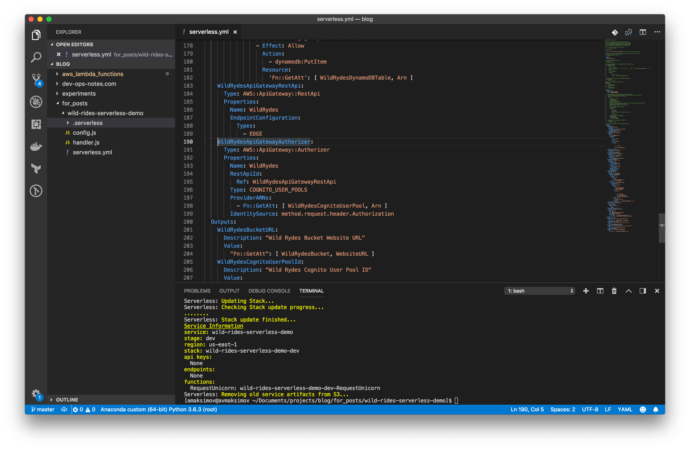

Redeploy your stack to setup Api Gateway Authorizer:

```sh
sls deploy
```

Let’s test our Authorizer. Open `/ride.html` web page and copy Authorization Token:


Go to **API Gateway** service in AWS console, open **WildRydes** API Gateway and select **Authorizers** in left menu. Click **Test** link:

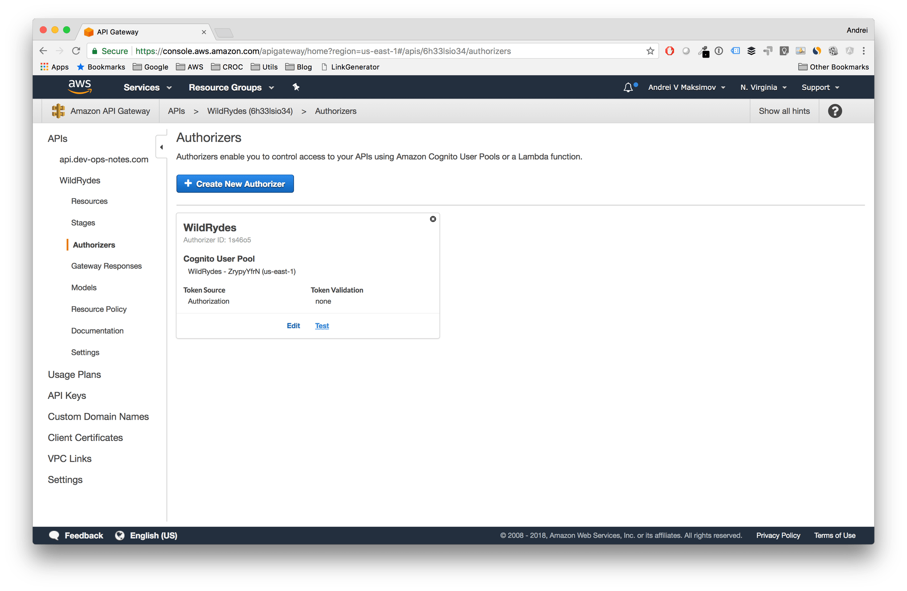

Paste your Authorization Token in the field and press **Test** button:


If you did everything correctly, you’ll see successful response:

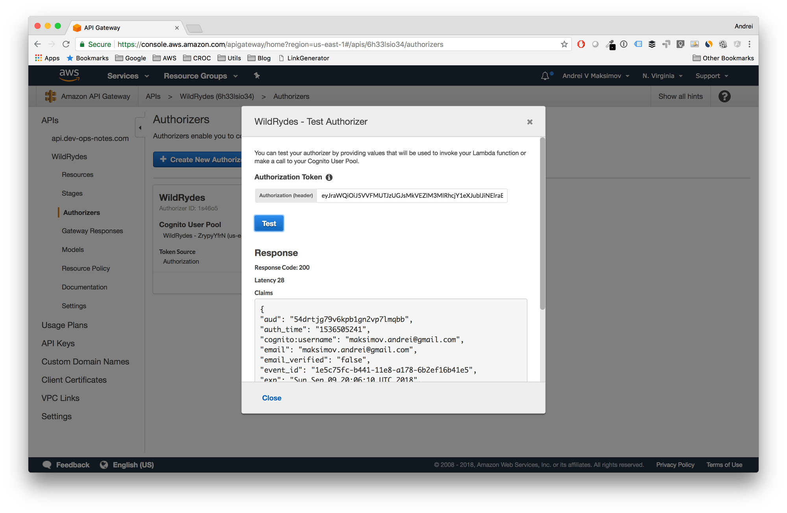

## Create new resource and method

Next we need to create a new [API Gateway Resource](https://docs.aws.amazon.com/AWSCloudFormation/latest/UserGuide/aws-resource-apigateway-resource.html) called `/ride` within your API. Then create a **POST** [API Gateway Method](https://docs.aws.amazon.com/AWSCloudFormation/latest/UserGuide/aws-resource-apigateway-method.html) for that resource and configure it to use a Lambda proxy integration backed by the RequestUnicorn Lambda function.

No problem, here’s its declaration:

```yaml
WildRydeApiGatewayRidesResource:
  Type: AWS::ApiGateway::Resource
  Properties:
    ParentId:
      Fn::GetAtt: [WildRydesApiGatewayRestApi, RootResourceId]
    PathPart: ride
    RestApiId:
      Ref: WildRydesApiGatewayRestApi
```


In the official tutorial we may click **Enable CORS** checkbox to Enable CORS for a needed resource. When you’re dealing with automation it is not always so easy. It means you need to implement “Enable CORS” functionality for an API Gateway Resource yourself. Somebody on StackOverflow [already did it for us](https://stackoverflow.com/questions/40292888/enable-cors-for-api-gateway-in-cloudformation-template), so we thankfully will take resource description example and adopt it for our needs:

```yaml
WildRydesRideOptionsMethod:
  Type: AWS::ApiGateway::Method
  Properties:
    AuthorizationType: NONE
    RestApiId:
      Ref: WildRydesApiGatewayRestApi
    ResourceId:
      Ref: WildRydeApiGatewayRidesResource
    HttpMethod: OPTIONS
    Integration:
      IntegrationResponses:
        - StatusCode: 200
          ResponseParameters:
            method.response.header.Access-Control-Allow-Headers: "'Content-Type,X-Amz-Date,Authorization,X-Api-Key,X-Amz-Security-Token'"
            method.response.header.Access-Control-Allow-Methods: "'POST,OPTIONS'"
            method.response.header.Access-Control-Allow-Origin: "'*'"
          ResponseTemplates:
            application/json: ''
      PassthroughBehavior: WHEN_NO_MATCH
      RequestTemplates:
        application/json: '{"statusCode": 200}'
      Type: MOCK
    MethodResponses:
      - StatusCode: 200
        ResponseModels:
          application/json: 'Empty'
        ResponseParameters:
          method.response.header.Access-Control-Allow-Headers: false
          method.response.header.Access-Control-Allow-Methods: false
          method.response.header.Access-Control-Allow-Origin: false
```

Redeploy your stack to check that everything’s working as expected:

```sh
sls deploy
```

Now we need to create the actual POST method:

```yaml
WildRydesRidePostMethod:
  Type: AWS::ApiGateway::Method
  Properties:
    AuthorizerId:
      Ref: WildRydesApiGatewayAuthorizer
    AuthorizationType: COGNITO_USER_POOLS
    HttpMethod: POST
    ResourceId:
      Ref: WildRydeApiGatewayRidesResource
    RestApiId:
      Ref: WildRydesApiGatewayRestApi
    Integration:
      Type: AWS_PROXY
      IntegrationHttpMethod: POST
      Uri:
        Fn::Join:
          - ':'
          - - 'arn:aws:apigateway'
            - Ref: 'AWS::Region'
            - 'lambda'
            - Fn::Join:
                - '/'
                - - 'path'
                  - '2015-03-31'
                  - 'functions'
                  - Fn::GetAtt: [RequestUnicornLambdaFunction, Arn]
                  - 'invocations'
```


This will create protected by API Gateway authorization POST method, which will call Lambda function for authorized users.

## Create your API deployment

Mostly we’re done. All we need to do is to create [API Gateway Deployment](https://docs.aws.amazon.com/AWSCloudFormation/latest/UserGuide/aws-resource-apigateway-deployment.html) to publish our API. Here it is:

```yaml
WildRydesApiGatewayDeployment:
  Type: AWS::ApiGateway::Deployment
  Properties:
    Description: Wild Rydes Api
    RestApiId:
      Ref: WildRydesApiGatewayRestApi
    StageName: ${opt:stage, 'dev'}
```

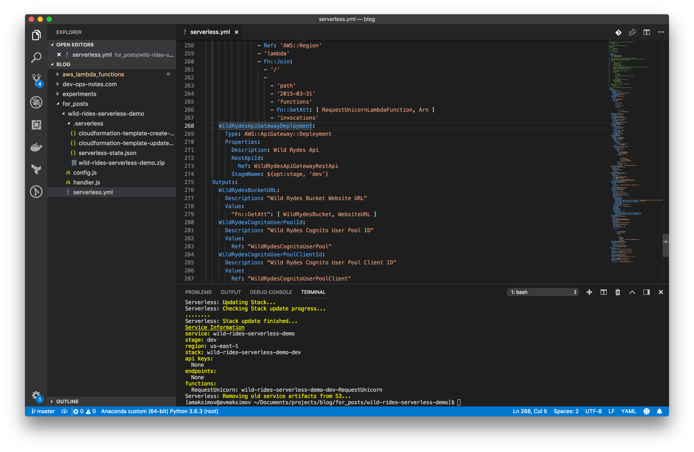

Here we’re using `${opt:stage, 'dev'}` to dynamically specify stage name. See [Variables](https://serverless.com/framework/docs/providers/aws/guide/variables/) for more info.

Let’s redeploy our stack to check that everything’s working as expected:

```sh
sls deploy
```

## Global stage declaration

Definitely we want to add global stage declaration, but not only for a single resource. To do so, add `stage:` parameter declared in the same way to `provider:` section:

```yaml
provider:
  name: aws
  runtime: nodejs8.10
  stage: ${opt:stage, 'dev'}
```


## Updating website config

Most of the work done. At this section we’ll complete our website configuration (`config.js` file which is still in our project folder). But first of all let’s get API Gateway Deployment URL. Specify this declaration of your `Outputs:` of `resources:` section:

```yaml
WildRydesApiGatewayUrl:
  Description: 'Wild Rydes Api Gateway URL'
  Value:
    'Fn::Join':
      - ''
      - - 'https://'
        - Ref: 'WildRydesApiGatewayRestApi'
        - '.execute-api.'
        - Ref: 'AWS::Region'
        - '.amazonaws.com'
        - "/${opt:stage, 'dev'}"
```

Now to get the url you can do:

```sh
sls deploy
sls info --verbose
```

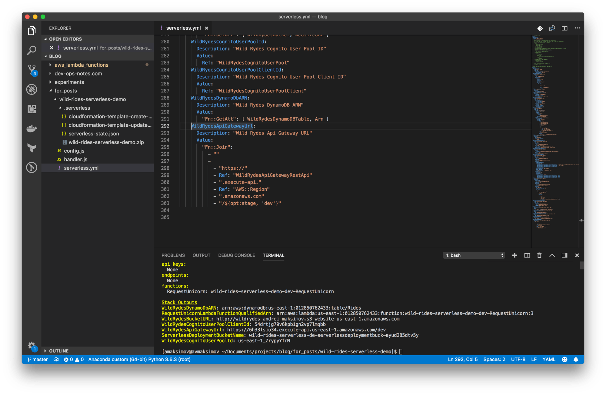

Next, we need to copy `WildRydesApiGatewayUrl` value to `invokeUrl:` of `config.js` file:


Upload `config.js` file to its location in S3 bucket and remove the file:

```sh
aws s3 cp ./config.js s3://wildrydes-firstname-lastname/js/config.js
rm ./config.js
```

## Validate your implementation

All we need to do here, is to visit `/ride.html` and click anywhere on the map to set a pickup Unicorn location.

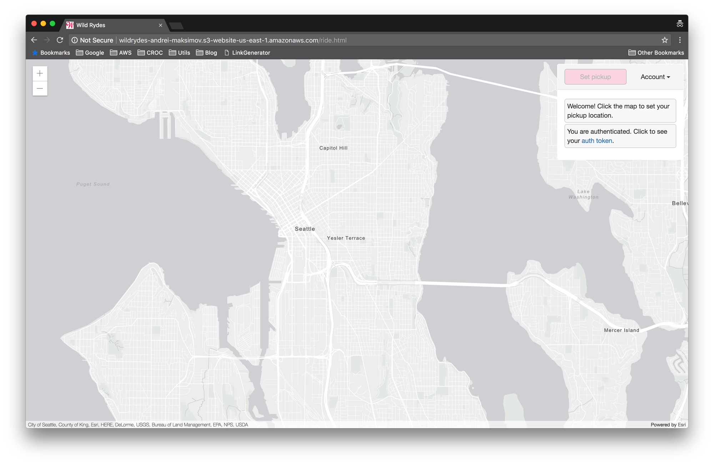

Choose **Request Unicorn**. You should see a notification in the right sidebar that a unicorn is on its way and then see a unicorn icon fly to your pickup location.

## Resource cleanup

To cleanup everything you need to call

```sh
aws s3 rm s3://wildrydes-firstname-lastname --recursive
sls remove
```

Congratulations! Hope, you’ve find this tutorial useful. Please, feel free to ask questions in the comments section! Good luck!
