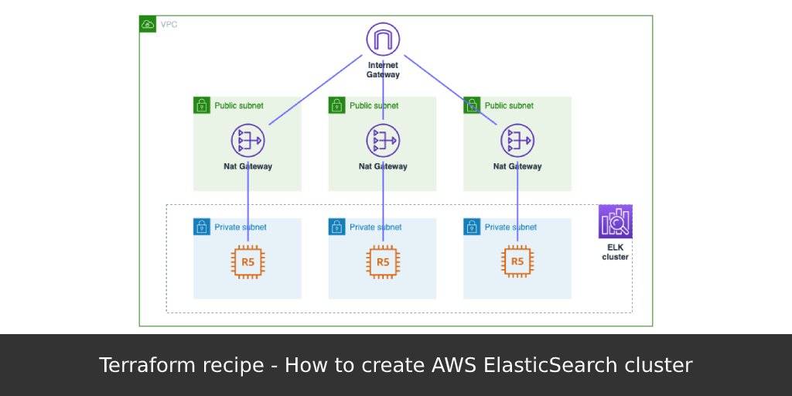

From this recipe you’ll learn how to create [AWS ElasticSearch](https://aws.amazon.com/elasticsearch-service/) cluster in VPC using [Terrafrom](https://www.terraform.io/).

Source code is available in my [GitHub repo](https://github.com/andreivmaksimov/terraform-recipe-how-to-create-aws-elasticsearch-cluster).

Amazon Elasticsearch Service is an AWS managed service, that makes it easy to deploy, operate, and scale Elasticsearch clusters.

Elasticsearch is a popular open-source search and analytics engine for the following use cases:

- log analytics
- real-time application monitoring
- clickstream analysis

Amazon ES provisions all the resources for your Elasticsearch cluster and launches it. It also automatically detects and replaces failed Elasticsearch nodes, reducing the overhead associated with self-managed infrastructures. You can scale your cluster with a single API call or a few clicks in the console.

To get started using Amazon ES, you create a `domain`. An Amazon ES domain is synonymous with an Elasticsearch cluster. Domains are clusters with the settings, instance types, instance counts, and storage resources that you specify.

## Setting up ElasticSearch cluster

As soon as we’re understanding the basics, we may start setting up our cluster.

Set of variables you’ll need:

```hcl
variable "vpc" {
  description = "VPC ID where to launch ElasticSearch cluster"
}

variable "vpc_cidr" {
  description = "CIDR to allow connections to ElasticSearch"
}

variable "region" {
  description = "AWS region to use"
}

variable "es_domain" {
  description = "ElasticSearch domain name"
}

variable "es_subnets" {
  type = "list"
  description = "List of VPC Subnet IDs to create ElasticSearch Endpoints in"
}
```

To get information about AWS region and caller identity you can use the following [data sources](https://www.terraform.io/docs/configuration/data-sources.html):

```hcl
data "aws_region" "current" {}

data "aws_caller_identity" "current" {}
```

Now we need a `aws_security_group` object to restrict network access to ElasticSearch cluster:

```hcl
resource "aws_security_group" "es_sg" {
  name = "${var.es_domain}-sg"
  description = "Allow inbound traffic to ElasticSearch from VPC CIDR"
  vpc_id = "${var.vpc}"

  ingress {
      from_port = 0
      to_port = 0
      protocol = "-1"
      cidr_blocks = [
          "${var.vpc_cidr}"
      ]
  }
}
```

Here we allowing any connections coming from our VPC address range.

The most interesting part is [aws_elasticsearch_domain](https://www.terraform.io/docs/providers/aws/r/elasticsearch_domain.html). It is needed to create cluster itself:

```hcl
resource "aws_elasticsearch_domain" "es" {
  domain_name = "${var.es_domain}"
  elasticsearch_version = "6.3"

  cluster_config {
      instance_type = "r4.large.elasticsearch"
  }

  vpc_options {
      subnet_ids = "${var.es_subnets}"
      security_group_ids = [
          "${aws_security_group.es_sg.id}"
      ]
  }

  ebs_options {
      ebs_enabled = true
      volume_size = 10
  }

  access_policies = <<CONFIG
{
  "Version": "2012-10-17",
  "Statement": [
      {
          "Action": "es:*",
          "Principal": "*",
          "Effect": "Allow",
          "Resource": "arn:aws:es:${data.aws_region.current.name}:${data.aws_caller_identity.current.account_id}:domain/${var.es_domain}/*"
      }
  ]
}
  CONFIG

  snapshot_options {
      automated_snapshot_start_hour = 23
  }

  tags {
      Domain = "${var.es_domain}"
  }
}
```

It can be very useful to get as an output ELK cluster endpoint and Kibana endpoint URLs:

```hcl
output "ElasticSearch Endpoint" {
  value = "${aws_elasticsearch_domain.es.endpoint}"
}

output "ElasticSearch Kibana Endpoint" {
  value = "${aws_elasticsearch_domain.es.kibana_endpoint}"
}
```
