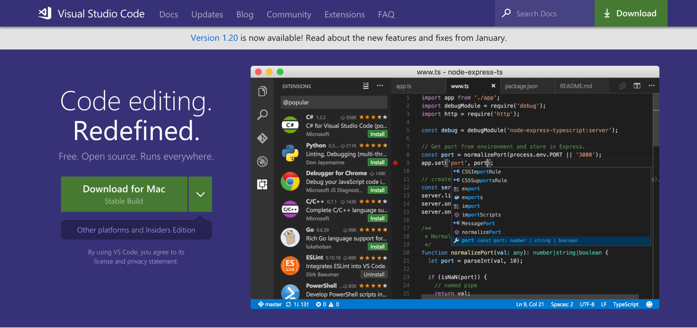
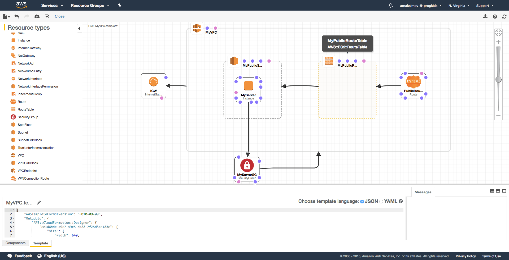
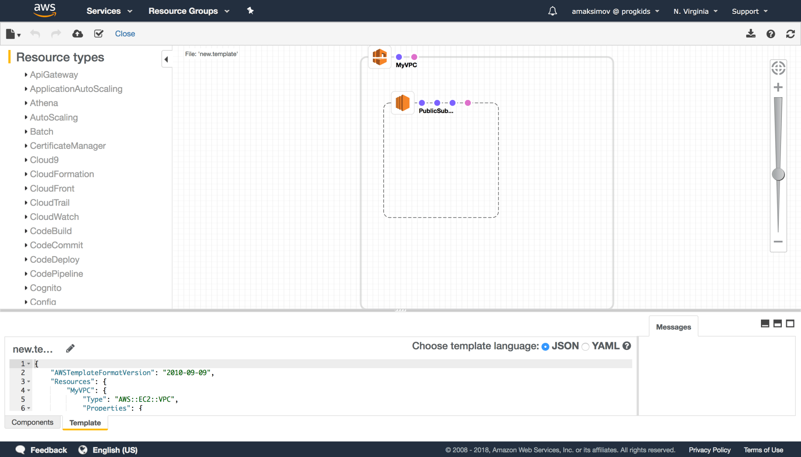
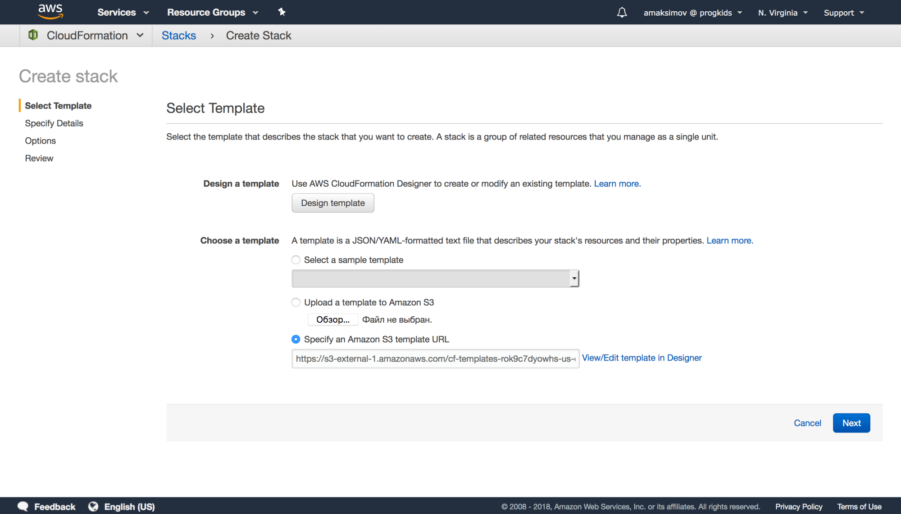
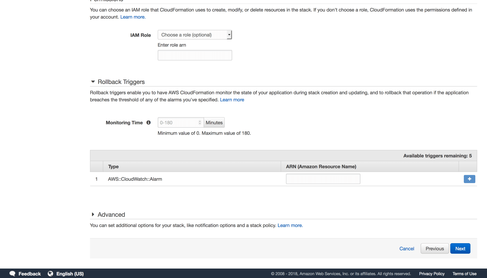
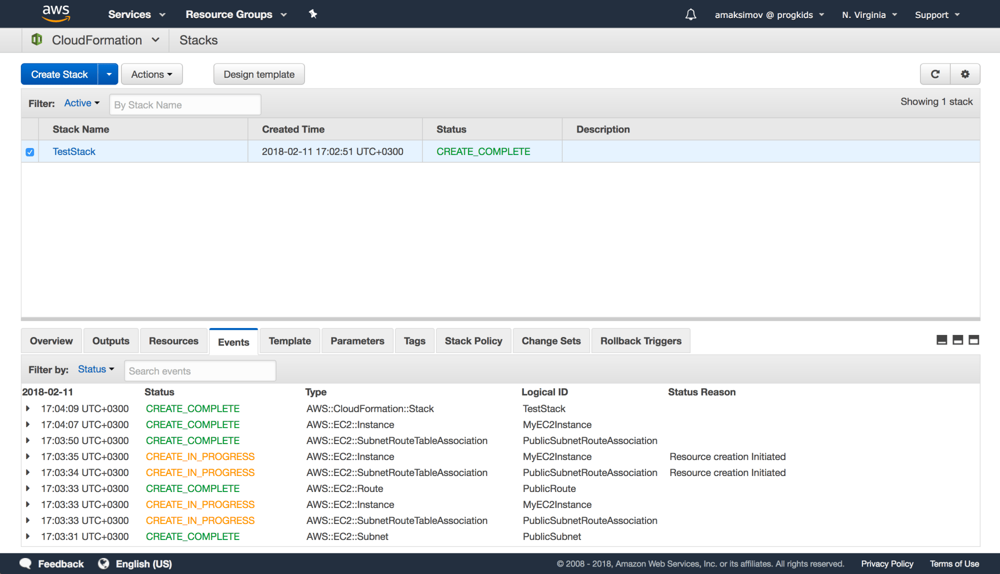
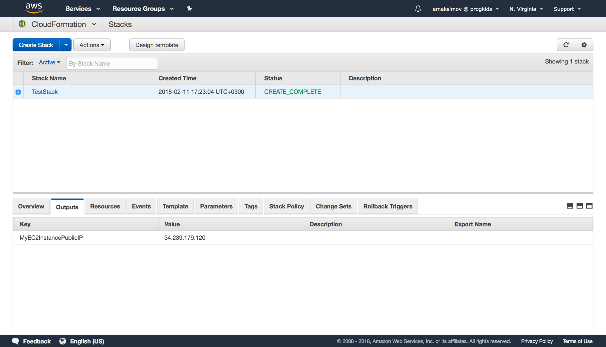
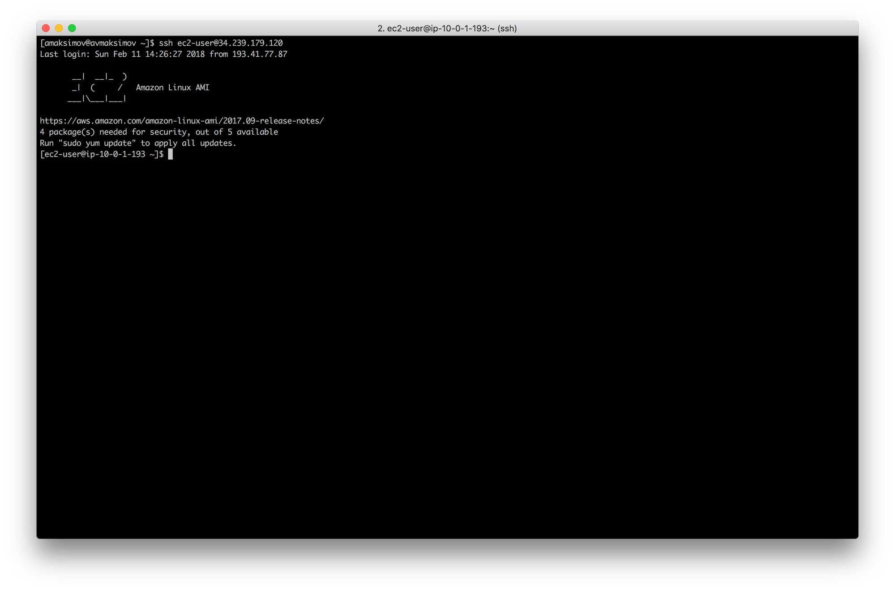

[CloudFormation](https://aws.amazon.com/cloudformation/) is the service which provides us an ability to create and manage any AWS infrastructure “as code” in a fully declarative way using a single or multiple files as a source of truth for your cloud environment. Usually it is not needed to understand it very deeply to pass AWS Associate Certification exams, but it is very important to use it on a daily basis especially for Solution Architects.

In todays post, I’ll try to minimize efforts and simplify your first steps in learning CloudFormation and we’ll be practicing in managing VPC.

## Json VS Yaml

CloudFormation supports two both JSON and Yaml syntax in your templates. You may use what ever you like. JSON syntax is looking a little bit more complex because a lot of brackets are used. In Yaml you need to track your indentations.

In any case, I recommend you to use [MS Visual Studio Code](https://code.visualstudio.com/) as your main editor and .template file extension for your templates. In that case VS Code will advice you to to use [CloudFormation plugin](https://marketplace.visualstudio.com/items?itemName=aws-scripting-guy.cform), which will highlight the file syntax a make you life much more easier.



## Visual designer

To simplify our life AWS brought us CloudFormation Designer, where we could build our target infrastructure using “Drag-n-Drop” technics in a visual manner. If you’re start building your template from scratch, it could be much more easy to start from the Designer.



At this point of time it is not very stable (it is not working with Chrome correctly and sometimes not drawing your complex infrastructures). You may find some issues reports from the community at [AWS CloudFormation Forums](https://forums.aws.amazon.com/forum.jspa?forumID=92).

And one more thing to add: if you want to use CloudFormation Designer for managing your templates, be ready, that it adds a lot of metadata with object coordinates and their connections, which make you template times bigger and not manageable. As I’ve already mentioned, CloudFormation Designer not working well and sometimes it not updating your elements connections correctly, so it could be very surprising that in one moment you’ll be not able to open your saved template.

**Good advice** here: use CloudFormation Designer only for validating your template syntax.

It is also possible to generate your infrastructure schema by your own template without any metadata in it. If your template is simple enough, Designer will magically draw it on the screen.

## What do you need to be productive with CloudFormation

I’m always keeping several tabs opened in my browser:

- CloudFormation Service inside AWS Console
- CloudFormation Designer – for template syntax validation
- [AWS Resource Types Reference](https://docs.aws.amazon.com/AWSCloudFormation/latest/UserGuide/aws-template-resource-type-ref.html) – this is the most important tab, where you can find all the elements, their required and optional parameters and output parameters also. You always need to understand how to get access to Instance private or public IP address to refer on it from the other resources inside your template.
- [Intrinsic Function Reference](https://docs.aws.amazon.com/AWSCloudFormation/latest/UserGuide/intrinsic-function-reference.html) – this tab could be very useful if you’re just starting with CloudFormation and don’t remember actual syntax of all available functions for your templates.

## Managing VPC

Let’s start building our own VPC using CloudFormation. First of all open a new file using your favourite text editor and name it somehow, for example `MyVPC.template`.

We’ll check every step in CloudFormation Designer to be sure, that everything’s working fine.

All the code is also available on my [GitHub repository](https://github.com/andreivmaksimov/aws-cloudformation-managing-vpc).

### Initial template

Let’s start from initial template content:

```json
{
  "AWSTemplateFormatVersion": "2010-09-09"
}
```

This `AWSTemplateFormatVersion` item means, that we’ll use `2010-09-09` version specification for our template.

We don’t need to check it CloudFormation Designer yet.

### VPC resource

Now let’s add an empty VPC service declaration inside our template. This needs to be done inside Resources section of the template like this:

```json
{
  "AWSTemplateFormatVersion": "2010-09-09",

  "Resources": {
    "MyVPC": {
      "Type": "AWS::EC2::VPC",
      "Properties": {}
    }
  }
}
```

Here we’re declaring [AWS::EC2::VPC](https://docs.aws.amazon.com/AWSCloudFormation/latest/UserGuide/aws-resource-ec2-vpc.html). So now, if you will paste whole template to the **Template** tab of the CloudFormation Designer, you’ll see the following picture:


### VPC ip address range

If you looked through VPC parameters in AWS Resource Reference Guide, you’ve found, that we have to specify `CidrBlock` parameter. And this parameter needs to be the type of String. Let’s add to the future template users an ability to provide this parameter themselves. To do so, we need to add `Parameters` section to our template:

```json
"Parameters": {
    "VpcCidrBlock": {
        "Description": "VPC CIDR Range",
        "Type": "String",
        "Default": "10.0.0.0/16"
    }
}
```

After that can easily insert a reference to this `Parameter`, where it is needed. In our case for `CidrBlock` parameter of our VPC resource. Like this:

```json
"CidrBlock": {
    "Ref": "VpcCidrBlock"
}
```

Here, we’re using special template function `Ref`:

```json
{ "Ref": "VpcCidrBlock" }
```

This function allows us to reference any declared template resources.

The full version of our template at this point of time will be:

```json
{
  "AWSTemplateFormatVersion": "2010-09-09",
  "Resources": {
    "MyVPC": {
      "Type": "AWS::EC2::VPC",
      "Properties": {
        "CidrBlock": {
          "Ref": "VpcCidrBlock"
        }
      }
    }
  },
  "Parameters": {
    "VpcCidrBlock": {
      "Description": "VPC CIDR Range (will be a /16 block)",
      "Type": "String",
      "Default": "10.0.0.0/16"
    }
  }
}
```

So using this template it’s future users will be able to create a VPC resource inside the Region, where CloudFormation service will process it.

### Public network

Strictly speaking, template which contains only one empty VPC resource is absolutely useless. Lets add public network to it. To do this we need to add additional [AWS::EC2::Subnet](https://docs.aws.amazon.com/AWSCloudFormation/latest/UserGuide/aws-resource-ec2-subnet.html) resource to the `Resources` section of our template:

```json
"PublicSubnet": {
    "Type": "AWS::EC2::Subnet",
    "Properties": {
        "VpcId": {
            "Ref": "MyVPC"
        },
        "CidrBlock": {
            "Ref": "PublicSubnetCidrBlock"
        },
        "MapPublicIpOnLaunch": "True"
    }
}
```

This resource has two required parameters `VpcId` and `CidrBlock`, that’s why we’re declaring both of them now.

We’re setting up `MapPublicIpOnLaunch` parameter to `True` to be able to launch EC2 instances in that subnet with public IPs later.

As you can see, we’re referencing `VpcId` using the same approach (`Ref` function, which will return us VPC Id after it has been created during template processing by CloudFormation).

The same idea with `CidrBlock`.

But wait, we don’t have any declarations with `PublicSubnetCidrBlock` name yet. Yes, you’re right. Let’s fix it by adding additional template parameter with that name to the Parameters section of our template:

```json
"PublicSubnetCidrBlock": {
    "Description": "Public Subnet CIDR Range",
    "Type": "String",
    "Default": "10.0.1.0/24"
}
```

The full version of our template at this point of time will be:

```json
{
  "AWSTemplateFormatVersion": "2010-09-09",
  "Resources": {
    "MyVPC": {
      "Type": "AWS::EC2::VPC",
      "Properties": {
        "CidrBlock": {
          "Ref": "VpcCidrBlock"
        }
      }
    },
    "PublicSubnet": {
      "Type": "AWS::EC2::Subnet",
      "Properties": {
        "VpcId": {
          "Ref": "MyVPC"
        },
        "CidrBlock": {
          "Ref": "PublicSubnetCidrBlock"
        },
        "MapPublicIpOnLaunch": "True"
      }
    }
  },
  "Parameters": {
    "VpcCidrBlock": {
      "Description": "VPC CIDR Range (will be a /16 block)",
      "Type": "String",
      "Default": "10.0.0.0/16"
    },
    "VpcCidrBlock": {
      "Description": "VPC CIDR Range (will be a /16 block)",
      "Type": "String",
      "Default": "10.0.0.0/16"
    }
  }
}
```

If you want to check it in CloudFormation Designer, you’ll get something like this



### Internet gateway (IGW)

Well done! We’ve just created CloudFormation template that will create new VPC and Public Subnet inside of it. As you know, we call Subnet “Public” only if it is connected to the Internet. Right now it is not connected to the Internet, because we don’t have Internet Gateway inside out VPC. Also, we need to create a Route through our IGW to the public networks: `0.0.0.0/0`. Let’s do it now.

First of all we’ll add [AWS::EC2::InternetGateway](https://docs.aws.amazon.com/AWSCloudFormation/latest/UserGuide/aws-resource-ec2-internetgateway.html) inside our `Resources` template section:

```json
"IGW" : {
    "Type" : "AWS::EC2::InternetGateway",
    "Properties" : {}
}
```

As you can see in Resource Reference Guide, Internet Gateway don’t have any Properties, except Tags. And at the bottom of the document it is told, that we need to use [AWS::EC2::VPCGatewayAttachment](https://docs.aws.amazon.com/AWSCloudFormation/latest/UserGuide/aws-resource-ec2-vpc-gateway-attachment.html) to connect our IGW to VPC. Let’s do it.

Add `AWS::EC2::VPCGatewayAttachment` declaration with name `IgwAttachment` to the `Resources` section of our template like this:

```json
"IgwAttachment" : {
    "Type" : "AWS::EC2::VPCGatewayAttachment",
    "Properties" : {
        "VpcId" : { "Ref" : "MyVPC" },
        "InternetGatewayId" : { "Ref" : "IGW" }
    }
}
```

So now we have an attachment of our IGW to our VPC. As you can see, it is done by using `Ref` function.

The full code of our template will look like this:

```json
{
  "AWSTemplateFormatVersion": "2010-09-09",
  "Resources": {
    "MyVPC": {
      "Type": "AWS::EC2::VPC",
      "Properties": {
        "CidrBlock": {
          "Ref": "VpcCidrBlock"
        }
      }
    },
    "PublicSubnet": {
      "Type": "AWS::EC2::Subnet",
      "Properties": {
        "VpcId": {
          "Ref": "MyVPC"
        },
        "CidrBlock": {
          "Ref": "PublicSubnetCidrBlock"
        },
        "MapPublicIpOnLaunch": "True"
      }
    },
    "IGW": {
      "Type": "AWS::EC2::InternetGateway",
      "Properties": {}
    },
    "IgwAttachment": {
      "Type": "AWS::EC2::VPCGatewayAttachment",
      "Properties": {
        "VpcId": { "Ref": "MyVPC" },
        "InternetGatewayId": { "Ref": "IGW" }
      }
    }
  },
  "Parameters": {
    "VpcCidrBlock": {
      "Description": "VPC CIDR Range (will be a /16 block)",
      "Type": "String",
      "Default": "10.0.0.0/16"
    },
    "PublicSubnetCidrBlock": {
      "Description": "Public Subnet CIDR Range",
      "Type": "String",
      "Default": "10.0.1.0/24"
    }
  }
}
```

Let’s check everything in CloudFormation Designer:


And the last thing to be done here before we could launch Instances inside this VPC is Public Route declaration. Let’s do it now.

### Public route

To add a Public Route to the Internet to our VPC Subnet we need to use [AWS::EC2::RouteTable](https://docs.aws.amazon.com/AWSCloudFormation/latest/UserGuide/aws-resource-ec2-route-table.html) and [AWS::EC2::Route](https://docs.aws.amazon.com/AWSCloudFormation/latest/UserGuide/aws-resource-ec2-route.html) resources. Let’s add them to the `Resources` section of our template. The `Route Table`:

```json
"PublicRouteTable" : {
    "Type" : "AWS::EC2::RouteTable",
    "Properties" : {
        "VpcId" : { "Ref" : "MyVPC" }
    }
}
```

And the actual `Route`:

```json
"PublicRoute" : {
    "Type" : "AWS::EC2::Route",
    "DependsOn" : "IGW",
    "Properties" : {
        "RouteTableId" : { "Ref" : "PublicRouteTable" },
        "DestinationCidrBlock" : "0.0.0.0/0",
        "GatewayId" : { "Ref" : "IGW" }
    }
}
```

As you can see, `PublicRoute` resource has `DependsOn` attribute, which tells CloudFormation, that this resource needs to be created right after the `IGW`.

To allow our future instances traffic from the Public Subnet to the Internet we need to attach our Route Table to the Public Subnet using the [AWS::EC2::SubnetRouteTableAssociation](https://docs.aws.amazon.com/AWSCloudFormation/latest/UserGuide/aws-resource-ec2-subnet-route-table-assoc.html) by adding it to Resources section of our template like this:

```json
"PublicSubnetRouteAssociation": {
    "Type" : "AWS::EC2::SubnetRouteTableAssociation",
    "Properties" : {
        "RouteTableId" : { "Ref" : "PublicRouteTable" },
        "SubnetId" : "PublicSubnet"
    }
}
```

The full code of our template at this time will look like this:

```json
{
  "AWSTemplateFormatVersion": "2010-09-09",
  "Resources": {
    "MyVPC": {
      "Type": "AWS::EC2::VPC",
      "Properties": {
        "CidrBlock": {
          "Ref": "VpcCidrBlock"
        }
      }
    },
    "PublicSubnet": {
      "Type": "AWS::EC2::Subnet",
      "Properties": {
        "VpcId": {
          "Ref": "MyVPC"
        },
        "CidrBlock": {
          "Ref": "PublicSubnetCidrBlock"
        },
        "MapPublicIpOnLaunch": "True"
      }
    },
    "IGW": {
      "Type": "AWS::EC2::InternetGateway",
      "Properties": {}
    },
    "IgwAttachment": {
      "Type": "AWS::EC2::VPCGatewayAttachment",
      "Properties": {
        "VpcId": { "Ref": "MyVPC" },
        "InternetGatewayId": { "Ref": "IGW" }
      }
    },
    "PublicRouteTable": {
      "Type": "AWS::EC2::RouteTable",
      "Properties": {
        "VpcId": { "Ref": "MyVPC" }
      }
    },
    "PublicRoute": {
      "Type": "AWS::EC2::Route",
      "DependsOn": "IGW",
      "Properties": {
        "RouteTableId": { "Ref": "PublicRouteTable" },
        "DestinationCidrBlock": "0.0.0.0/0",
        "GatewayId": { "Ref": "IGW" }
      }
    },
    "PublicSubnetRouteAssociation": {
      "Type": "AWS::EC2::SubnetRouteTableAssociation",
      "Properties": {
        "RouteTableId": { "Ref": "PublicRouteTable" },
        "SubnetId": { "Ref": "PublicSubnet" }
      }
    }
  },
  "Parameters": {
    "VpcCidrBlock": {
      "Description": "VPC CIDR Range (will be a /16 block)",
      "Type": "String",
      "Default": "10.0.0.0/16"
    },
    "PublicSubnetCidrBlock": {
      "Description": "Public Subnet CIDR Range",
      "Type": "String",
      "Default": "10.0.1.0/24"
    }
  }
}
```

And CloudFormation Designer version:


### Security group

To logically finish our example, let’s launch an Instance inside our VPC and make it available on port **22** and **80**, for example. But before that, we need to create a [AWS::EC2::SecurityGroup](https://docs.aws.amazon.com/AWSCloudFormation/latest/UserGuide/aws-properties-ec2-security-group.html). Let’s add this resource type to the Resources section of our template:

```json
"InstanceSecurityGroup" : {
    "Type" : "AWS::EC2::SecurityGroup",
    "Properties" : {
        "GroupDescription" : "Allow HTTP and SSH traffic to our host",
        "VpcId" : {"Ref" : "myVPC"},
        "SecurityGroupIngress" : [
            {
                "IpProtocol" : "tcp",
                "FromPort" : "22",
                "ToPort" : "22",
                "CidrIp" : "0.0.0.0/0"
            },
            {
                "IpProtocol" : "tcp",
                "FromPort" : "80",
                "ToPort" : "80",
                "CidrIp" : "0.0.0.0/0"
            }
        ],
        "SecurityGroupEgress" : [
            {
                "IpProtocol" : "tcp",
                "FromPort" : "1",
                "ToPort" : "65535",
                "CidrIp" : "0.0.0.0/0"
            }
        ]
    }
}
```

Our full template code right now will look like this:

```json
{
  "AWSTemplateFormatVersion": "2010-09-09",
  "Resources": {
    "MyVPC": {
      "Type": "AWS::EC2::VPC",
      "Properties": {
        "CidrBlock": {
          "Ref": "VpcCidrBlock"
        }
      }
    },
    "PublicSubnet": {
      "Type": "AWS::EC2::Subnet",
      "Properties": {
        "VpcId": {
          "Ref": "MyVPC"
        },
        "CidrBlock": {
          "Ref": "PublicSubnetCidrBlock"
        },
        "MapPublicIpOnLaunch": "True"
      }
    },
    "IGW": {
      "Type": "AWS::EC2::InternetGateway",
      "Properties": {}
    },
    "IgwAttachment": {
      "Type": "AWS::EC2::VPCGatewayAttachment",
      "Properties": {
        "VpcId": { "Ref": "MyVPC" },
        "InternetGatewayId": { "Ref": "IGW" }
      }
    },
    "PublicRouteTable": {
      "Type": "AWS::EC2::RouteTable",
      "Properties": {
        "VpcId": { "Ref": "MyVPC" }
      }
    },
    "PublicRoute": {
      "Type": "AWS::EC2::Route",
      "DependsOn": "IGW",
      "Properties": {
        "RouteTableId": { "Ref": "PublicRouteTable" },
        "DestinationCidrBlock": "0.0.0.0/0",
        "GatewayId": { "Ref": "IGW" }
      }
    },
    "PublicSubnetRouteAssociation": {
      "Type": "AWS::EC2::SubnetRouteTableAssociation",
      "Properties": {
        "RouteTableId": { "Ref": "PublicRouteTable" },
        "SubnetId": { "Ref": "PublicSubnet" }
      }
    },
    "InstanceSecurityGroup": {
      "Type": "AWS::EC2::SecurityGroup",
      "Properties": {
        "GroupDescription": "Allow HTTP and SSH traffic to our host",
        "VpcId": { "Ref": "MyVPC" },
        "SecurityGroupIngress": [
          {
            "IpProtocol": "tcp",
            "FromPort": "22",
            "ToPort": "22",
            "CidrIp": "0.0.0.0/0"
          },
          {
            "IpProtocol": "tcp",
            "FromPort": "80",
            "ToPort": "80",
            "CidrIp": "0.0.0.0/0"
          }
        ],
        "SecurityGroupEgress": [
          {
            "IpProtocol": "tcp",
            "FromPort": "1",
            "ToPort": "65535",
            "CidrIp": "0.0.0.0/0"
          }
        ]
      }
    }
  },
  "Parameters": {
    "VpcCidrBlock": {
      "Description": "VPC CIDR Range (will be a /16 block)",
      "Type": "String",
      "Default": "10.0.0.0/16"
    },
    "PublicSubnetCidrBlock": {
      "Description": "Public Subnet CIDR Range",
      "Type": "String",
      "Default": "10.0.1.0/24"
    }
  }
}
```

And the Designer, of cause:


### Instance

It seems that we’re ready to launch an `Instance` in our VPC inside Public Subnet. As you may already guess, we’ll be using [AWS::EC2::Instance](https://docs.aws.amazon.com/AWSCloudFormation/latest/UserGuide/aws-properties-ec2-instance.html). Let’s do it:

```json
"MyEC2Instance" : {
    "Type" : "AWS::EC2::Instance",
    "Properties" : {
        "ImageId" : "ami-97785bed",
        "KeyName" : { "Ref": "SSHKeyName"},
        "SubnetId": {
            "Ref": "PublicSubnet"
        },
        "InstanceType": "t2.small",
        "SecurityGroupIds": [
            {
                "Ref": "InstanceSecurityGroup"
            }
        ]
    }
}
```

Here I’m using Amazon Linux AMI available in N.Virginia Region. Our `t2.small` `MyEC2Instance` will be launched in our `PublicSubnet` and have a `SecurityGroup` `InstanceSecurityGroup`.

Also, we’re referencing to `SSHKeyName` which we need to declare in `Parameters` section of our template as a `List of Strings`.

```json
"SSHKeyName": {
    "Description": "Name of an existing EC2 KeyPair to enable SSH access to the instances",
    "Type": "AWS::EC2::KeyPair::KeyName",
    "ConstraintDescription": "must be the name of an existing EC2 KeyPair."
}
```

Declared in such way `SSHKeyName` will return us a selected SSH Key by the user or our template if it has been created before. If not, we assume that it will be added manually before launching the Stack from this template.

Also, it will be useful to get our instance Public IP as an output parameter of our template. Let’s add the last declaration to our template in `Outputs` section:

```json
"MyEC2InstancePublicIP": {
    "Value": {
        "Fn::GetAtt": [
            "MyEC2Instance",
            "PublicIp"
        ]
    }
}
```

So, our final template version for this point of time will look like this:

```json
{
  "AWSTemplateFormatVersion": "2010-09-09",
  "Resources": {
    "MyVPC": {
      "Type": "AWS::EC2::VPC",
      "Properties": {
        "CidrBlock": {
          "Ref": "VpcCidrBlock"
        }
      }
    },
    "PublicSubnet": {
      "Type": "AWS::EC2::Subnet",
      "Properties": {
        "VpcId": {
          "Ref": "MyVPC"
        },
        "CidrBlock": {
          "Ref": "PublicSubnetCidrBlock"
        },
        "MapPublicIpOnLaunch": "True"
      }
    },
    "IGW": {
      "Type": "AWS::EC2::InternetGateway",
      "Properties": {}
    },
    "IgwAttachment": {
      "Type": "AWS::EC2::VPCGatewayAttachment",
      "Properties": {
        "VpcId": { "Ref": "MyVPC" },
        "InternetGatewayId": { "Ref": "IGW" }
      }
    },
    "PublicRouteTable": {
      "Type": "AWS::EC2::RouteTable",
      "Properties": {
        "VpcId": { "Ref": "MyVPC" }
      }
    },
    "PublicRoute": {
      "Type": "AWS::EC2::Route",
      "DependsOn": "IGW",
      "Properties": {
        "RouteTableId": { "Ref": "PublicRouteTable" },
        "DestinationCidrBlock": "0.0.0.0/0",
        "GatewayId": { "Ref": "IGW" }
      }
    },
    "PublicSubnetRouteAssociation": {
      "Type": "AWS::EC2::SubnetRouteTableAssociation",
      "Properties": {
        "RouteTableId": { "Ref": "PublicRouteTable" },
        "SubnetId": { "Ref": "PublicSubnet" }
      }
    },
    "InstanceSecurityGroup": {
      "Type": "AWS::EC2::SecurityGroup",
      "Properties": {
        "GroupDescription": "Allow HTTP and SSH traffic to our host",
        "VpcId": { "Ref": "MyVPC" },
        "SecurityGroupIngress": [
          {
            "IpProtocol": "tcp",
            "FromPort": "22",
            "ToPort": "22",
            "CidrIp": "0.0.0.0/0"
          },
          {
            "IpProtocol": "tcp",
            "FromPort": "80",
            "ToPort": "80",
            "CidrIp": "0.0.0.0/0"
          }
        ],
        "SecurityGroupEgress": [
          {
            "IpProtocol": "tcp",
            "FromPort": "1",
            "ToPort": "65535",
            "CidrIp": "0.0.0.0/0"
          }
        ]
      }
    },
    "MyEC2Instance": {
      "Type": "AWS::EC2::Instance",
      "Properties": {
        "ImageId": "ami-97785bed",
        "KeyName": { "Ref": "SSHKeyName" },
        "SubnetId": {
          "Ref": "PublicSubnet"
        },
        "InstanceType": "t2.small",
        "SecurityGroupIds": [
          {
            "Ref": "InstanceSecurityGroup"
          }
        ]
      }
    }
  },
  "Parameters": {
    "VpcCidrBlock": {
      "Description": "VPC CIDR Range (will be a /16 block)",
      "Type": "String",
      "Default": "10.0.0.0/16"
    },
    "PublicSubnetCidrBlock": {
      "Description": "Public Subnet CIDR Range",
      "Type": "String",
      "Default": "10.0.1.0/24"
    },
    "SSHKeyName": {
      "Description": "Name of an existing EC2 KeyPair to enable SSH access to the instances",
      "Type": "AWS::EC2::KeyPair::KeyName",
      "ConstraintDescription": "must be the name of an existing EC2 KeyPair."
    }
  },
  "Outputs": {
    "MyEC2InstancePublicIP": {
      "Value": {
        "Fn::GetAtt": ["MyEC2Instance", "PublicIp"]
      }
    }
  }
}
```

And at the Designer:


I think it’s enough for now. Let’s try to launch our template.

## Launching CloudFormation template

Paste our final template in the **Template** tab of the Designer and press **Launch Template** button. CloudFormation Designer will upload our template code to S3 and show you that screen. Don’t change anything and press **Next**:



On the next page input **Stack Name** and choose a **SSH Key** from the drop down menu. I’ll be using my own Key with name Lenovo. Also, you may change VPC and Subnet address space if needed. I’ll leave everything as is. Click **Next**.


At the next step we may add additional resource tags, IAM role for CloudFomation and other Stack creation parameters, which are out of the scope of this article. Leave everything as is and click **Next**.



This is the final screen where you can review all the parameters before launching the Stack. If everything is OK, click **Create** button.


As soon as you’ll click Create button, CloudFormation start processing your template and launch your declared infrastructure.


In a couple of minutes, you’ll see **CREATE_COMPLETE** status for your Stack.



Congratulations! You’ve just created your first CloudFormation Stack. You’ve created everything from scratch: VPC, Subnets, Internet Gateway, Route Table, Security Group and launched the Instance.

You may find your Instance public IP Address at the `Output` tab of your Stack.



You may also try to connect your instance using SSH:



## CloudFormation best practices

- **Don’t hardcode object names**: where is possible try to avoid using hardcoded names for your objects like S3 bucket or IAM objects, for example. As you know, some of the objects needs to be unique in your account, some of the objects globally. Try to launch 2 or more stacks from your template to be sure, that nothing is hardcoded. Following this principle will allow you to use you templates as many times as needed.
- **Tag everything**: add Tags everywhere it is possible. it will allow you to control costs for your infrastructure and increase manageability of it.
- **Don’t put RDS or instance DB hosts inside the template**: if something goes wrong and you’ll need to recreate your infrastructure, CloudFormation will delete all the resources it has created. So, to avoid your data loss, don’t manage your databases layer using Cloud Formation.

## Final words

Hope, you’ll find this article interesting and helpful! If so, please, Share or Like it on any Social media you want! If you have any questions, please feel free to contact me in the comments of the article. See you soon.
