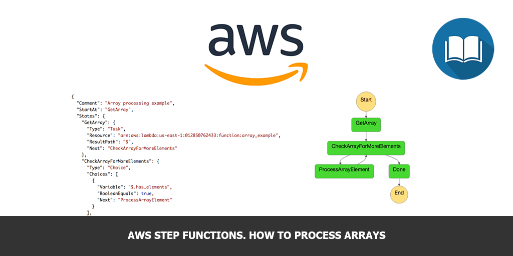
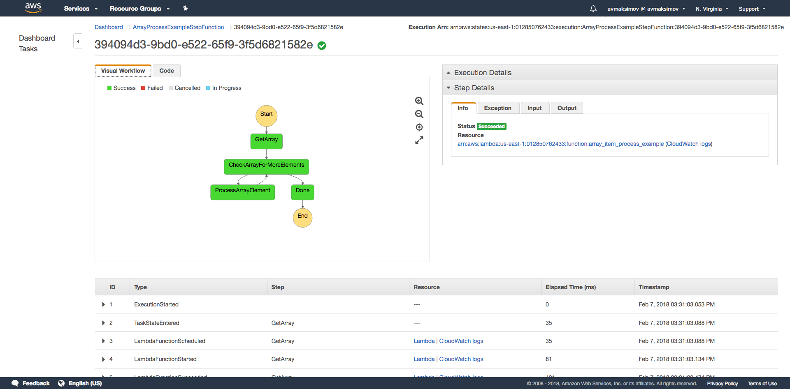

Nowadays Serverless computing topic become extrimely popular. It is so tasty to implement business process using several AWS Lambda functions and pay very low price for it’s execution. But everybody who tried to implement several Lambda functions interraction knows, that it is not so easy task.

At the 1st of Descember of 2016 AWS anonced, that they brought us a Step Functions – a visual workflow way to coordinate microservices. The main idea of the service is to give us an ability to describe the whole microservice architecture as a finite state machine and visualize it of cause.

Everybody who’s trying to use Step Functions first time usually don’t understand how to process arrays using this approach. In this post I’ll show you how to do it.

## The problem

Let’s imagine, that we have a Lambda Function, that returns an array of elements. We need to process this elements by another Lambda Function. How we could build such kind of microservice interraction using Step Functions?

## Lambda functions

Let’s create a Lambda Function, that produces an array (`fruits` in our example):

```js
exports.handler = (event, context, callback) => {
  var fruits = ['apple', 'orange', 'pinaple'];

  event.fruits = fruits;

  if (event.fruits.length > 0) {
    event.has_elements = true;
  } else {
    event.has_elements = false;
  }

  callback(null, event);
};
```

Pay attantion, that I’m adding `has_elements` flag to the function output. We’ll use this flag to check if we need to process more elements.

Let’s create another Lambda Function, that will process array elements:

```js
exports.handler = (event, context, callback) => {
  let fruit = event.fruits.shift();
  // Process array element
  console.log('Processing fruit: ' + fruit);

  // Array still has elements:
  if (event.fruits.length > 0) {
    event.has_elements = true;
  } else {
    event.has_elements = false;
  }

  // Log array elements (for demonstration purpose)
  console.log('Elements in array: ' + event.fruits);
  console.log('Array has more elements: ' + event.has_elements);

  callback(null, event);
};
```

The main idea is to remove processed elements from the array. We’re using `.shift()` method for that purpose here, which will remove first element from the array.

And again we’re setting up `has_elements` flag at the end of element processing.

Now we’re ready to create a Step Function algorythm.

## Step function

Here’s our algorythm visualization:



And our Step Function algorythm:

```json
{
  "Comment": "Array processing example",
  "StartAt": "GetArray",
  "States": {
    "GetArray": {
      "Type": "Task",
      "Resource": "arn:aws:lambda:us-east-1:012850762433:function:array_example",
      "ResultPath": "$",
      "Next": "CheckArrayForMoreElements"
    },
    "CheckArrayForMoreElements": {
      "Type": "Choice",
      "Choices": [
        {
          "Variable": "$.has_elements",
          "BooleanEquals": true,
          "Next": "ProcessArrayElement"
        }
      ],
      "Default": "Done"
    },
    "ProcessArrayElement": {
      "Type": "Task",
      "Resource": "arn:aws:lambda:us-east-1:012850762433:function:array_item_process_example",
      "ResultPath": "$",
      "Next": "CheckArrayForMoreElements"
    },

    "Done": {
      "Type": "Pass",
      "End": true
    }
  }
}
```

This algorythm consists of several steps:

- `GetArray` – Step Function Task which will execute array_example Lambda functions, which will return fruits array:

  ```json
  {
    "fruits": ["apple", "orange", "pinaple"],
    "has_elements": true
  }
  ```

- `CheckArrayForMoreElements` – Conditional Step to check if we have more array elements to process. If yes, go to `ProcessArrayElement` Step, otherwise finish going to Step `Done`
- `ProcessArrayElement` – Step Function Task that will process an array item. For example, it’s Input for last element:

  ```json
  {
    "fruits": ["pinaple"],
    "has_elements": true
  }
  ```

And the final Output:

```json
{
  "fruits": [],
  "has_elements": false
}
```

## Final words

We’ve just implemented simple Step Function algorythm to orchestrate processing of an array elements. Hope, you’ll find this article useful. If you have any questions, feel free to contact me in comments!
