This is fully open source blog, where you can propose and make any kind of changes: UI, UX, blog articles, and many others.

## Short workflow for tech authors

- Fork and clone our [blog repository](https://github.com/hands-on-cloud/hands-on.cloud)
- Create new branch: `git checkout -b my_new_article`
- Create folder inside `src/pages` with the name of your article
- create `index.md` file inside your folder
- Put article content and metadata using [Markdown](https://www.markdownguide.org/basic-syntax/) format inside `index.md` file
- Add all nesessary article images to your folder
- Commit your changes: `git add . && git commit`
- Push to remote repository branch: `git push origin my_new_article`
- Send pull request and review your changes

Keep your branch till we accept your changes.

If something needs to be done additionaly, simply make all necessary changes, then

- Update your local commit `git add . && git commit --amend --no-edit`
- Update remote branch `git push -f origin my_new_article`

## Long way for non-tech authors

Here we'll show you a process of adding new article using GitHub Web interface.

## Fork repository

First of all you need to fork our public repository: [https://github.com/hands-on-cloud/hands-on.cloud](https://github.com/hands-on-cloud/hands-on.cloud). Go to repository page and press `Fork` button.

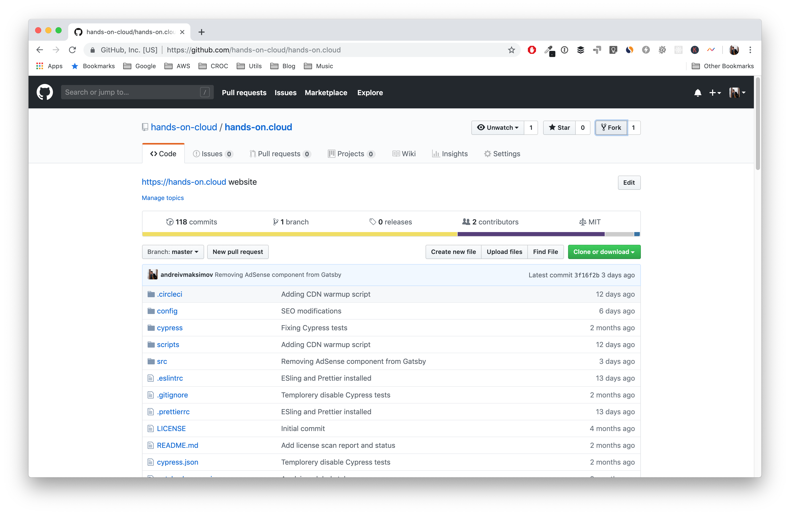

If you're contriguting to multiple organizations, choose your personal GitHub account.

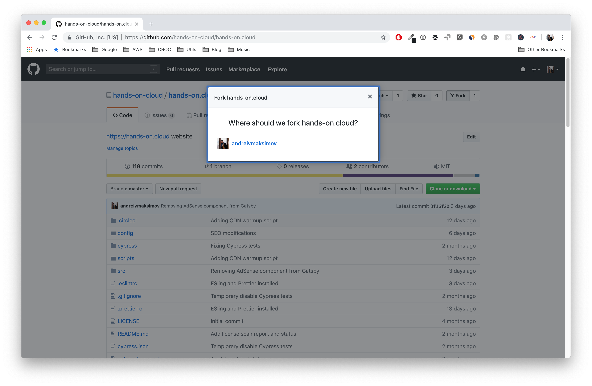

Give GitHub a couple of seconds to make a copy of our repository.


## Create an article

First of all, create a new branch, where you'll be working under your article. In our case we'll be using `my_new_article` branch name.


As soon as new branch created, we may start working unders our article.

Go to `src/pages` folder.


Here we need create an article foder, which will contain article images and content written in Markdown (`index.md`). Folder name will be automatically converted to an article URL (for example, folder `New Interesting Article` will be automatically converted to `/new-interesting-article/` URL.

Let's create folder and `index.md` file.

Press `Create new file` button.

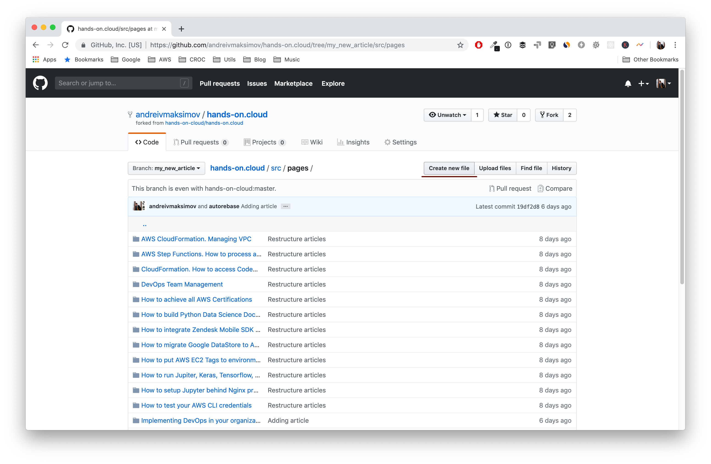

Type folder name at input field.

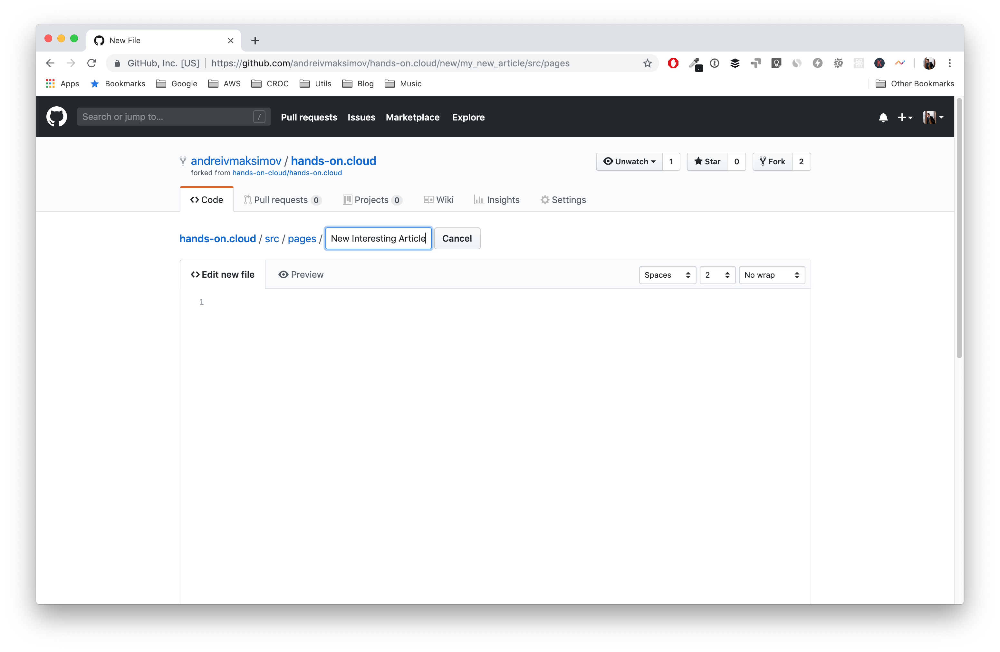

Press `/` to start typing file name.

Inter `index.md` to a field.


### Article text and metadata

Next, put your article content styled using [Markdown syntax](https://www.markdownguide.org/basic-syntax/) in the file body.

At the beginning of the file content, you need to add additional block

```md
---
title: 'New Interesting Article'
date: '2019-05-11'
thumbnail: './New-Interesting-Article.png'
tags:
  - aws cloud
  - certification
  - aws
  - devops
category: 'aws'
authors:
  - John Doe
---
```

Which will add additional medadata to your post like:

- `title` - title of your article
- `date` - publication date
- `tags` - list of post tags; list of already available tags can be found [here](https://hands-on.cloud/tags/)
- `category` - category of an article; list of already available tags can be found [here](https://github.com/hands-on-cloud/hands-on.cloud/blob/master/gatsby-config.js)
- `authors` - list of authors; put your name here, you'll see how to add author information below

Switch to `Preview` tab to see your changes. Do not pay attention to invisible images for now. We'll upload them later. At the next step.

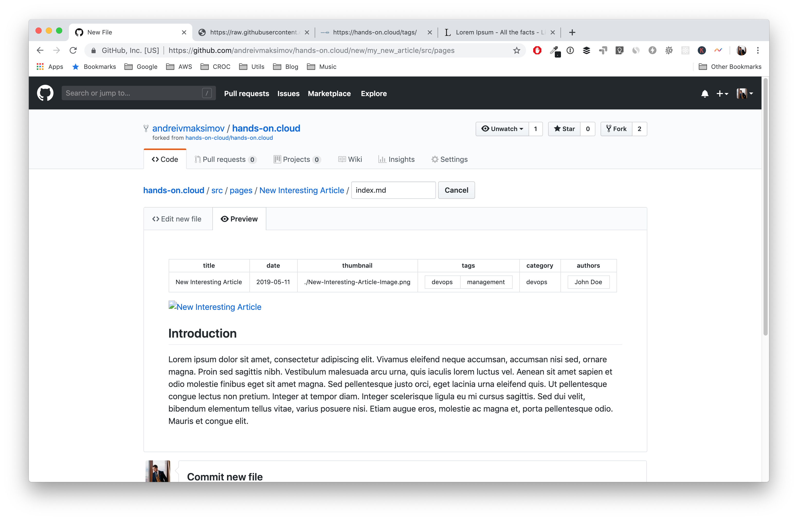

As soon as you're ready to publish your changes, describe your changes at the `Commit new file` section and press `Commit new file` button.

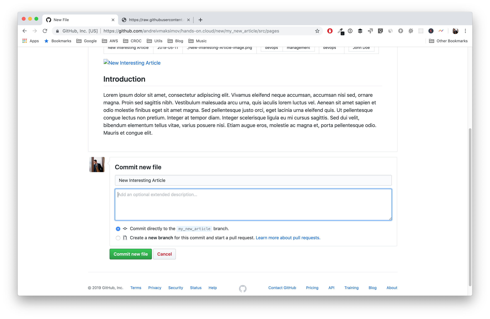

As a result you should have something like that:

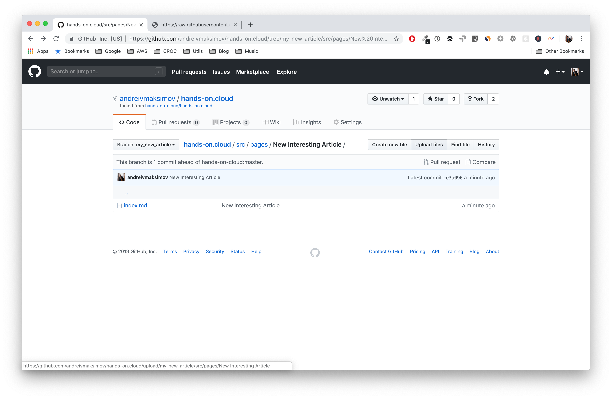

### Adding images to the article

`Thumbnail template`: You may use [this template](Article Image Template.psd) to create article tumbnails.

At post metadata we specified thumbnail image with the name `New-Interesting-Article.png`, so we need to use exactly the same file name for uploaded image, otherwise we'll not be able to see it in the article.

Press `Upload files` button and upload your image(s).


### Checking final result

After uploading all images you may click on your article `index.md` file to review, how it looks like

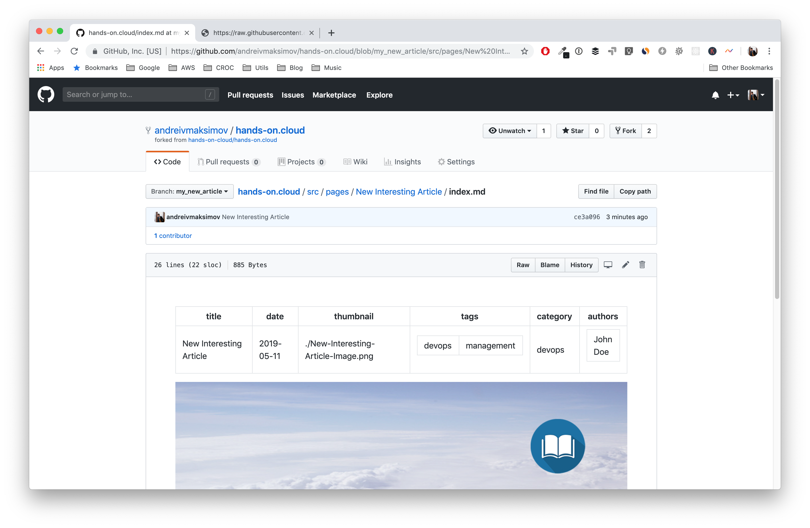

If everything looks good, you may submit pull request.

### Adding author imformation

At post metadata we specified `John Doe` as an author name.

To add information about this author, we need to create file `John Doe.json` at `src/data/authors` folder of our project:


Press `Create new file` button and add `John Doe.json` to the file name field. Use the following template to add information about yourself:

```json
{
  "name": "John Doe",
  "avatar": "https://avatars2.githubusercontent.com/u/1902417?s=460&v=4",
  "bio": {
    "short": "John is a passionate Cloud Solutions Architect with 8+ years of experience",
    "long": "John is Cloud Solutions Architect, blogger, mentor. He is trying to make modern technologies available to the masses!"
  },
  "linkedin": "https://www.linkedin.com/in/avmaksimov",
  "github": "https://github.com/andreivmaksimov",
  "facebook": "https://business.facebook.com/andrei.v.maksimov",
  "twitter": "https://twitter.com/andreivmaksimov",
  "instagram": "https://www.instagram.com/andrei_v_maksimov"
}
```

Here's the filds description:

- `name` - Author name. Should be the same as the file name without extension. In our example `John Doe`
- `avatar` - You may use your GitHub profile image or one from [Gravatar](https://gravatar.com)
- `bio` - short and long biography description
- `linkedin` - link to your [LinkedIn](https://https://linkedin.com) profile
- `github` - link to your [GitHub](https://github.com) profile
- `facebook` - link to your [Facebook](https://facebook.com) profile
- `twitter` - link to your [Twitter](https://twitter.com) profile
- `instagram` - link to your [Instagram](https://instagram.com) profile

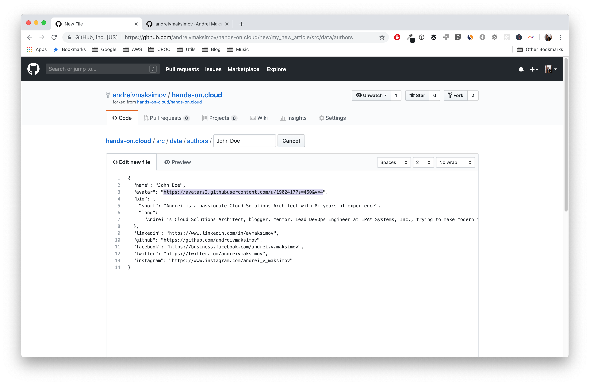

## Making pull request

To send us your changes, go to repository homepage and click `Compare & pull request` button.

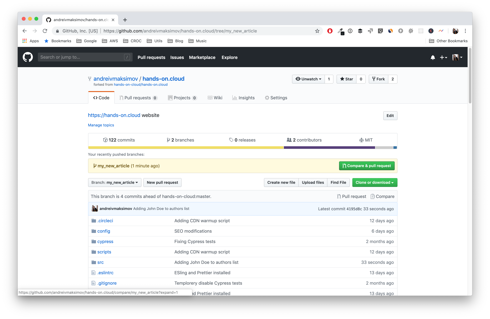

Describe the changes you've made and press `Send pull request button`


You'll see, how our automation is working

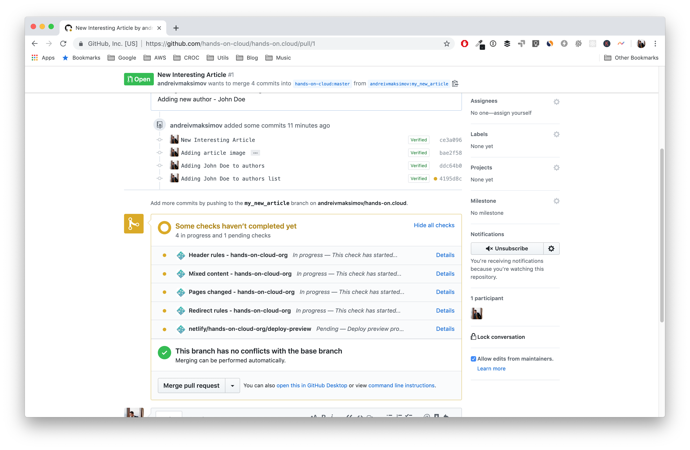

Next, somebody from our team will verify your changes and merge them.
