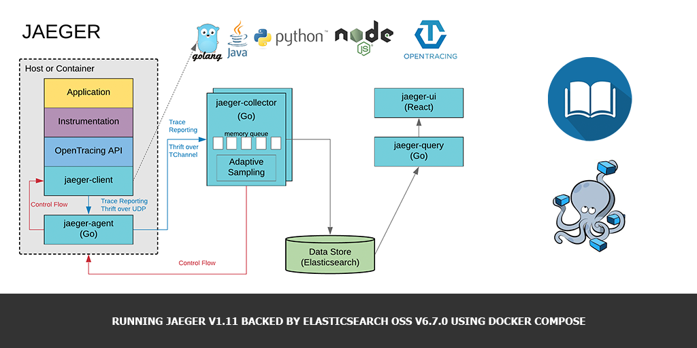

A couple of days already I'm playing with [Jager](https://www.jaegertracing.io) - distributed tracing system inspired by [Dapper](https://research.google.com/pubs/pub36356.html) and [OpenZipkin](http://zipkin.io/), which been opensourced by [Uber Technologies](http://uber.github.io/).

This system solves the following problems:

- Distributed context propagation
- Distributed transaction monitoring
- Root cause analysis
- Service dependency analysis
- Performance / latency optimization

After acomplishing a couple of [tutorials](https://github.com/yurishkuro/opentracing-tutorial) I decided to try launch it using Elasticsearch as a backend storage. The main idea is to launch Jaeger for one of our clients in AWS using Docker, Fargate and ElasticSearch. Before moving to AWS infrastructure I've decided to test all the components together locally using Docker Compose. It was not so trivial exercise, so here, I'm sharing my [docker-compose.yml](https://gist.github.com/andreivmaksimov/e8a644e73026c46f18664db25a80b993), which hopefuly will save you some time.

## Requirements

There's the list of requirements

- Docker v18.09.0 (or higher)
- Elasticsearch v6.7.0 (or higher)
- Jaeger v1.11 (there's some copability problems with between Jaeger components of different versions now, so I'll be specific here)

## Environment configuration

In this environment you'll be able to access [Kibana](https://www.elastic.co/products/kibana) at `http://localhost:5601` and jaeger-ui at `http://localhost:16686`

```yaml
version: '2.2'

services:
  elasticsearch:
    image: docker.elastic.co/elasticsearch/elasticsearch-oss:6.7.0
    environment:
      - 'discovery.type=single-node'
      - 'ES_JAVA_OPTS=-Xmx256m -Xms256m'
    ulimits:
      memlock:
        soft: -1
        hard: -1
    ports:
      - 9200:9200
      - 9300:9300
    networks:
      - elk

  kibana:
    image: docker.elastic.co/kibana/kibana-oss:6.7.0
    environment:
      - 'SERVER_NAME=kibana'
      - 'ELASTICSEARCH_HOSTS=http://elasticsearch:9200'
    ports:
      - 5601:5601
    networks:
      - elk
    depends_on:
      - 'elasticsearch'

  jaeger-collector:
    image: jaegertracing/jaeger-collector:1.11
    environment:
      - 'SPAN_STORAGE_TYPE=elasticsearch'
    ports:
      - '14268:14268'
      - '14267'
      - '9411:9411'
    restart: on-failure
    command:
      [
        '--es.server-urls=http://elasticsearch:9200',
        '--span-storage.type=elasticsearch',
        '--log-level=error',
      ]
    networks:
      - elk

  jaeger-query:
    image: jaegertracing/jaeger-query:1.11
    ports:
      - '16686:16686'
    restart: on-failure
    command:
      [
        '--es.server-urls=http://elasticsearch:9200',
        '--span-storage.type=elasticsearch',
        '--log-level=debug',
        '--es.sniffer=false',
      ]
    depends_on:
      - elasticsearch
      - jaeger-collector
    networks:
      - elk

  jaeger-agent:
    image: jaegertracing/jaeger-agent:1.11
    environment:
      - 'SPAN_STORAGE_TYPE=elasticsearch'
    command: ['--collector.host-port=jaeger-collector:14267']
    ports:
      - '5775:5775/udp'
      - '6831:6831/udp'
      - '6832:6832/udp'
      - '5778:5778'
    restart: on-failure
    depends_on:
      - jaeger-collector
      - elasticsearch
    networks:
      - elk

networks:
  elk:
    driver: bridge
```

## Final worlds

In the next article I'll try to describe Jaeger deployment in AWS cloud using Fargate and Elasticsearch services.

Stay tuned!
