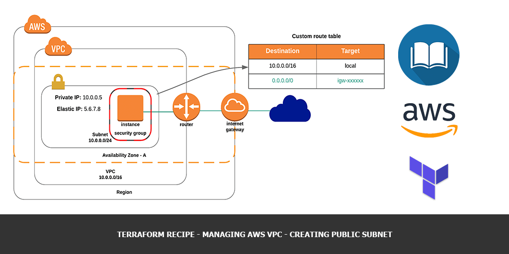
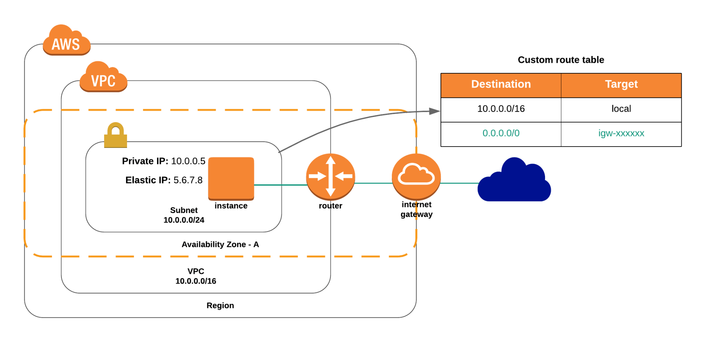

One of the basic task of your cloud infrastructure management is managing your VPC’s networks. In this article we’ll learn, how to declare most commonly used configuration:

*   Public subnet

In the [next article](/terraform-recipe-managing-aws-vpc-creating-private-subnets) we’ll extend this infrastructure by adding a private subnet to our VPC.

You may find complete source of `.tf` file in my [GitHub repo](https://github.com/andreivmaksimov/terraform-recipe-managing-aws-vpc-creating-public-subnet).

## VPC with single public subnet

Configuration for this scenario includes a virtual private cloud (VPC) with a single public subnet, Internet Gateway and Route Table to enable communication over the Internet. AWS recommends this configuration if you need to run a single-tier, public-facing web application, such as a blog or a simple website.

Here’s how the infrastructure looks like:



Let’s create this infrastructure step by step.

First of all you need to create a new terraform file with any name and `.tf` extension. I’ll be using `vpc_with_single_public_subnet.tf`.

Next we need to declare [aws_vpc](https://www.terraform.io/docs/providers/aws/r/vpc.html) resource which will represents a new VPC with `10.0.0.0/16` address space:

```terraform
resource "aws_vpc" "my_vpc" {
  cidr_block       = "10.0.0.0/16"
  enable_dns_hostnames = true

  tags {
    Name = "My VPC"
  }
}
```

We’re also enabling DNS support inside of our VPC (`enable\_dns\_hostnames`) and setting `Name` tag to `My VPC`, so we could easily find our VPC in AWS console later, if we need to.

As soon as VPC resource declared, we’re ready to declare [aws_subnet](https://www.terraform.io/docs/providers/aws/r/subnet.html) resource, which will describe our Public Subnet.

```terraform
resource "aws_subnet" "public" {
  vpc_id     = "${aws_vpc.my_vpc.id}"
  cidr_block = "10.0.0.0/24"
  availability_zone = "us-east-1a"

  tags {
    Name = "Public Subnet"
  }
}
```

Here we’re asking terraform to create our Subnet in a VPC by creating a reference: `vpc_id` value is taken from `aws_vpc` resource declaration with name `my_vpc` by it’s `id`.

Also, we’re specifying Subnet address space within VPC by setting up `cidr_block` option to `10.0.0.0/24` value.

Each subnet in a VPC belongs to one of available AWS Availability Zones within AWS Regions. So, we’re also specifying it by setting `availability_zone` option to `us-east-1a` value.

Public Subnets are called so, because they have public route (`0.0.0.0/0`) in their Route Table, which is attached to VPC Internet Gateway.

So, let’s create an Internet Gateway now by specifying [aws\_internet\_gateway](https://www.terraform.io/docs/providers/aws/r/internet_gateway.html) resource:

```terraform
resource "aws_internet_gateway" "my_vpc_igw" {
  vpc_id = "${aws_vpc.my_vpc.id}"

  tags {
    Name = "My VPC - Internet Gateway"
  }
}
```

This entity attached to a VPC will allow Internet traffic to\from our Subnet. As we already discussed, we also need to create a Route Table with the route to outside world and map it to our Internet Gateway. Let’s do it by declaring [aws\_route\_table](https://www.terraform.io/docs/providers/aws/r/route_table.html) and [aws\_route\_table\_association](https://www.terraform.io/docs/providers/aws/r/route_table_association.html) resources:

```terraform
resource "aws_route_table" "my_vpc_us_east_1a_public" {
    vpc_id = "${aws_vpc.my_vpc.id}"

    route {
        cidr_block = "0.0.0.0/0"
        gateway_id = "${aws_internet_gateway.my_vpc_igw.id}"
    }

    tags {
        Name = "Public Subnet Route Table"
    }
}

resource "aws_route_table_association" "my_vpc_us_east_1a_public" {
    subnet_id = "${aws_subnet.public.id}"
    route_table_id = "${aws_route_table.my_vpc_us_east_1a_public.id}"
}
```

Here we just declared Route Table for our Subnet, and make an association between them.

Our Public Subnet is ready to launch new instances inside of it.  Let’s do it now.

One of the security features of AWS is Security Group – it is a stateful firewall rule, which is allowing inbound traffic to the network object it’s applied. In our case we’ll use it block any outside connections to our instance except of SSH.


Let’s add Security Group by adding [aws\_security\_group](https://www.terraform.io/docs/providers/aws/r/security_group.html) resource to our `.tf` file:

```terraform
resource "aws_security_group" "allow_ssh" {
  name        = "allow_ssh_sg"
  description = "Allow SSH inbound connections"
  vpc_id = "${aws_vpc.my_vpc.id}"

  ingress {
    from_port   = 22
    to_port     = 22
    protocol    = "tcp"
    cidr_blocks = ["0.0.0.0/0"]
  }

  egress {
    from_port       = 0
    to_port         = 0
    protocol        = "-1"
    cidr_blocks     = ["0.0.0.0/0"]
  }

  tags {
    Name = "allow_ssh_sg"
  }
}
```

Here we’re allowing incoming SSH connections (22/tcp) from any addresses (0.0.0.0/0) inside the Security Group and also we’re allowing any connection initiation to outside world from the Security Group. So, we’ll be able to SSH to the instance protected by this Security Group and make any connections from it. Security Group itself created inside our VPC.

It’s time create our instance to test everything. Let’s declaring [aws_instance](https://www.terraform.io/docs/providers/aws/r/instance.html) resource:

```teraform
resource "aws_instance" "my_instance" {
  ami           = "ami-0ac019f4fcb7cb7e6"
  instance_type = "t2.micro"
  key_name = "Lenovo T410"
  vpc_security_group_ids = [ "${aws_security_group.allow_ssh.id}" ]
  subnet_id = "${aws_subnet.public.id}"
  associate_public_ip_address = true

  tags {
    Name = "My Instance"
  }
}
```

Here we’re specified **Ubuntu 18.04** AMI `id` in us-east-1 region, set instance size to the smallest available – `t2.micro` and set SSH-key name. If you don’t have it yet, please, create or upload one for you here: [https://console.aws.amazon.com/ec2/v2/home?region=us-east-1#KeyPairs:sort=keyName](https://console.aws.amazon.com/ec2/v2/home?region=us-east-1#KeyPairs:sort=keyName).

Also we’ve launched our instance in just created Public Subnet and protected it with our Security Group.

To allow connection from outside world we also asked AWS to attach temporary Public IP address to our instance by setting `associate\_public\_ip\_address` option to `true`.

And the last thing we need to add to our `.tf` file is the output resource, which will print us our instance Public IP address:

```terraform
output "My Instance Public IP" {
  value = "${aws_instance.my_instance.public_ip}"
}
```

## Creating infrastructure

To apply this configuration all you need to do is to go to project folder and run the following commands:

```sh
terraform init
terraform apply
```

## SSH-ing to the host

At the end of infrastructure creation process terraform printed you a Public IP address of your instance. To SSH to it you need to run the following command:

```sh
ssh ubuntu@public_host_ip
```

## Tier down infrastructure

To remove all created resources all you need to do is to go to project folder and run the following command:

```sh
terraform destroy
```

## Final words

In this article you’ve created a simple AWS infrastructure from scratch, which consists of separate VPC, Internet Gateway, Subnet, Route Table, Security Group and the EC2 Instance. In the next article we’ll extend this infrastructure by adding a private subnet to our VPC.
