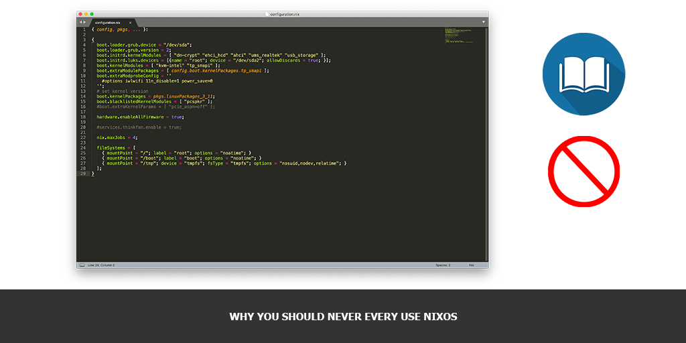

I’ll start my article from the biggest myth about NixOS. And soon you’ll know why.

> DevOps-friendly. Declarative specs and safe upgrades make NixOS a great system for DevOps use. NixOps, the NixOS cloud deployment tool, allows you to provision and manage networks of NixOS machines in environments like Amazon EC2 and VirtualBox. (c) [NixOS.org](https://nixos.org/)

I will continuously update this article each time I’ll face a new weird and challenging task that makes your life much harder if you’re using NixOS instead of traditional Linux distributions.

Well, I’m a lucky guy… I have no choice right now and have to spend most of my working time on NixOS automation. To this moment of time I have more than 10 years experience of using different Linux distributions and more than 6 months of NixOS experience. And most of my experience with NixOS is bad experience.

## Why you may want to use NixOS

I’ll try to write something here. Hope, I’ll be able to…

### Determinism

It is declared and provided to you by the system design, that you’ll get the same version of any software package from the derivation. Lie!

All it’s determinism is about that it deterministically gives you a lot of issues, which you need to overcome manually without any support.

You may install Nix tools on Linux and OS X, for example. But it is not always building the same derivation results on Linux and NixOS itself. So, it is not OS agnostic. There’re a lot of examples of such behavior, for example, `fetchgit` and `fetchFromGitHub` functions:

*   [fetchgit/fetchFromGitHub fail to fetch submodules from “git@server:repo” URLs](https://github.com/NixOS/nixpkgs/issues/28324)
*   [Use `fetchFromGitHub` instead of `fetchgit` when the source is a GitHub clone URL](https://github.com/NixOS/cabal2nix/issues/260)
*   [fetchgit -> fetchFromGitHub where possible](https://github.com/NixOS/nixpkgs/pull/27327)
*   [How to manually replicate/reproduce/obtain the sha256 hash specified in Nix with fetchgit or fetchFromGitHub?](https://github.com/NixOS/nix/issues/1880)

Meanwhile in the official manual to the current and latest [version-18-09-1373-50fb6820759](https://nixos.org/nixpkgs/manual/#version-18-09-1373-50fb6820759) they are still using `fetchgit`.

## Why you should never ever use NixOS

Here I’m gonna collect all my daily pain in a single place, which I hope will help people not to make somebody’s else mistakes. This is my personal view on the problem space and it can not be affiliated with the company or project where I’m working right now.

### Small community

Sure, there are a lot of enthusiasts who are playing with NixOS by installing it on their workstations of VMs, but in comparison with Ubuntu, CentOS, Debian or RedHat:

<script type="text/javascript" src="https://ssl.gstatic.com/trends_nrtr/1754_RC01/embed_loader.js"></script> <script type="text/javascript"> trends.embed.renderExploreWidget("TIMESERIES", {"comparisonItem":[{"keyword":"/g/11bw4cknm7","geo":"US","time":"today 12-m"},{"keyword":"/m/03x5qm","geo":"US","time":"today 12-m"},{"keyword":"/m/03x_8t","geo":"US","time":"today 12-m"},{"keyword":"/m/02996","geo":"US","time":"today 12-m"},{"keyword":"/m/06hkz","geo":"US","time":"today 12-m"}],"category":0,"property":""}, {"exploreQuery":"date=today%2012-m,today%2012-m,today%2012-m,today%2012-m,today%2012-m&geo=US,US,US,US,US&q=%2Fg%2F11bw4cknm7,%2Fm%2F03x5qm,%2Fm%2F03x_8t,%2Fm%2F02996,%2Fm%2F06hkz","guestPath":"https://trends.google.com:443/trends/embed/"}); </script>

That means you will not be able:

*   To get fast or enterprise support
*   To to hire people to manage it

### Documentation

Official documentation is awful. Or it is just absent. NixOS is older than Docker. They are solving the same task, but NixOS is way less popular. Try to think why.

NIX CONFIGURATION LANGUAGE
It is functional language which name is also Nix and it is a core of this system configuration. If you’re coming from OOP world it will be very difficult to understand that “language”. You must go to swallow [Nix pills](https://nixos.org/nixos/nix-pills/) to even try to understand something about it.

SOFTWARE MANAGEMENT
“Derivation” is a way of describing software distribution in NixOS. Each derivation represents software, plugin or a library. Common syntax of describing it looks like this (nginx derivation example):

```nix
{ stdenv, fetchurl, openssl, zlib, pcre, libxml2, libxslt
, gd, geoip
, withDebug ? false
, withStream ? true
, withMail ? false
, modules ? []
, version, sha256, ...
}:

with stdenv.lib;

stdenv.mkDerivation {
  name = "nginx-${version}";

  src = fetchurl {
    url = "https://nginx.org/download/nginx-${version}.tar.gz";
    inherit sha256;
  };

  buildInputs = [ openssl zlib pcre libxml2 libxslt gd geoip ]
    ++ concatMap (mod: mod.inputs or []) modules;

  configureFlags = [
    "--with-http_ssl_module"
    "--with-http_v2_module"
    "--with-http_realip_module"
    "--with-http_addition_module"
    "--with-http_xslt_module"
    "--with-http_geoip_module"
    "--with-http_sub_module"
    "--with-http_dav_module"
    "--with-http_flv_module"
    "--with-http_mp4_module"
    "--with-http_gunzip_module"
    "--with-http_gzip_static_module"
    "--with-http_auth_request_module"
    "--with-http_random_index_module"
    "--with-http_secure_link_module"
    "--with-http_degradation_module"
    "--with-http_stub_status_module"
    "--with-threads"
    "--with-pcre-jit"
    # Install destination problems
    # "--with-http_perl_module"
  ] ++ optional withDebug [
    "--with-debug"
  ] ++ optional withStream [
    "--with-stream"
    "--with-stream_geoip_module"
    "--with-stream_realip_module"
    "--with-stream_ssl_module"
    "--with-stream_ssl_preread_module"
  ] ++ optional withMail [
    "--with-mail"
    "--with-mail_ssl_module"
  ]
    ++ optional (gd != null) "--with-http_image_filter_module"
    ++ optional (with stdenv.hostPlatform; isLinux || isFreeBSD) "--with-file-aio"
    ++ map (mod: "--add-module=${mod.src}") modules;

  NIX_CFLAGS_COMPILE = [ "-I${libxml2.dev}/include/libxml2" ] ++ optional stdenv.isDarwin "-Wno-error=deprecated-declarations";

  preConfigure = (concatMapStringsSep "\n" (mod: mod.preConfigure or "") modules);

  hardeningEnable = optional (!stdenv.isDarwin) "pie";

  enableParallelBuilding = true;

  postInstall = ''
    mv $out/sbin $out/bin
  '';

  meta = {
    description = "A reverse proxy and lightweight webserver";
    homepage    = http://nginx.org;
    license     = licenses.bsd2;
    platforms   = platforms.all;
    maintainers = with maintainers; [ thoughtpolice raskin fpletz ];
  };
}
```

Interesting, isn’t it?

If yes, get ready, you’ll not be able to live in the system without writing something like that. [Nix Packages GitHub repository](https://github.com/NixOS/nixpkgs) will be your second home, where you’ll be looking for examples of Nix expressions, configuration approaches and other examples.

### Configuration management

System state and configuration described in a special file `configuration.nix`. It’s like an entry point to endless amount of functions and dependencies for your OS.

Want to customize something in the OS, be ready, you’ll need to write your custom `systemd` service to do that. Aaand, yes, service configuration file also need to be declared using Nix expression language.

All standard system configuration files like `/etc/fstab`, for example are generated by a weird code and read only.

Forget about Chef, Puppet or Ansible! Only Nix expressions! Only hardcore!

### Kernel upgrade

It is not possible just to upgrade the kernel from “ver1” to “ver2”. New kernel will bring whole set of system packages and their dependencies with it. Do not know if it is safe. Will test it soon.

### Cloud support

Nix is not ready for a cloud. At all. I’m always facing the following situations on NixOS 18.03:

*   OS is not booting from the AMI
*   OS is not supporting newest AWS instance types (like m5.*, for example)
*   NixOS 18.03 is not always able to resize your hard drive when it’s boot
*   Do not even try to use it in Auto Scaling group and passing configuration.nix content through user-data. You may easily get to the loop, when instance start building something new from the derivations during it’s boot process, 100% CPU utilizations will require AutoScaling Group to launch additional instances that also will build something, all the instances are  unhealthy and Auto Scaling group will start terminating the first instance in a loop. Your service will never start.

### Cache

To speedup software installation in NixOS the community provides you with Nix Binary Cache, where they put everything they’ve built successfully. Every version of every derivation.

Problems start happening when you spinning up your personal cache, which is used, for example to store your proprietary build artifacts. You always need to keep eye on the community channel version you’re using as a base for your builds. And yes, your own cache size will also grow very fast!

Some very talented developers start using Nix binary cache to cache everything’s possible. For example NPM or Yarn packages. Good luck!

### Security

People are thinking, that NixOS deterministic approach of dealing with software is very secure. Maybe yes, it is really not possible to hijack the build results once the derivation bin build. But… You always need to pay for it…

During the upgrade from 18.03 to 18.09 Nix community decided to change Docker tools they’ve been use to calculate derivations checksums where you were dealing with Docker images.

As a result we rewrote all Docker based derivation declarations and more over to rebuild them all. It was really painful and unmanaged migration.

### Windows support

Just forget about it.

### System requirements

It requires a lot of CPU power to build it’s stuff and really a lot of space to store its multiple versions. Much more, than you need in traditional Linux distros.

### Once invested

*   Try to change a technology stack as soon as possible.
*   Do not listen anybody.
*   Do not reinvent the wheel.
*   Just waste it.

And, God, do not try to run Nix in Docker! It’s really, not, REALLY bad idea!

### What to do next

Run away! Not, seriously! Run. From. It. Away.

When you try to summarize all your thoughts around the topic you want to cover in a post, you’re starting from simple Google search. One of results to my “nixos pros and cons” query: [NixOS alternatives](https://alternative.me/nixos). Kinda joke, but really, think twice when you’re making decision to invest your time or money in it. And I would also think twice about WHY colleagues are advising it to me.

### Docker is the best alternative

The link is in previous paragraph. Your choice is traditional Linux and Docker! Yes, you’ll have the same deterministic and secure result and even more more with less pain and and much pleasure.

### Additional reading

*   [NixOS users, tell me: What are the cons?](https://www.reddit.com/r/NixOS/comments/441ymh/nixos_users_tell_me_what_are_the_cons/)
*   [What is Nix and why you should try it?](https://news.ycombinator.com/item?id=15478209)
*   [NixOS on Distrowatch](https://distrowatch.com/table.php?distribution=nixos)
