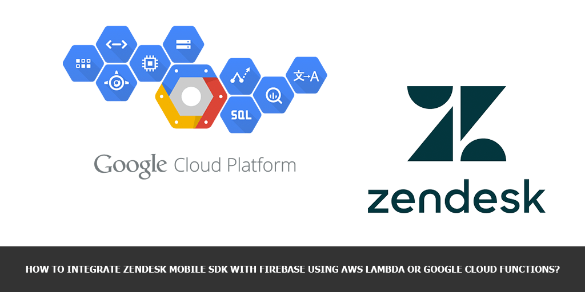
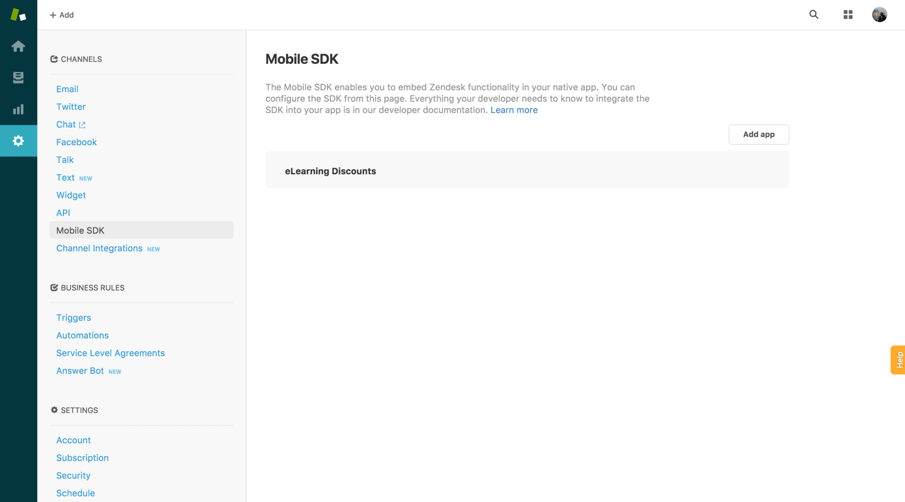

Everybody knows, that you may authenticate you users for Zendesk Mobile SDK using JWT (JSON Web Token). More over, that are a lot of HOWTO-s, which are showing JWT implementation in many different programming languages. In this tutorial I’ll show you, how to use Google Cloud Functions, NodeJS with some additional npm additions to create a fully scalable and absolutely free Serverless JWT authentication backend for Zendesk Mobile SDK.

## WHY GOOGLE?

Of cause you may use AWS Lambda functions to implement the similar solution, but in my own opinion using a single product (Google Firebase) for iOS backend operations is much more easier, then using a couple of services from AWS. So, the main reason was Firebase.

At the same time Google gives you great logging solution for all its services, so you don’t need to implement something special and reinvent the wheel. Just use single solution for all your services.

And the third one – API. Of cause in my own opinion Google’s API is the best I’ve ever saw. Only Google provides your with the detailed explanation of most of the errors and provides you with the direct URL links to it’s console to, for example, enable the required service.

## WHAT IS SERVERLESS, CLOUD FUNCTIONS AND LAMBDA?

Think of it like a lightweight PaaS hosting based on container technologies with some limitations which makes this technology  super fast and scalable. This hosting is storing your pieces of code which are, ready to be launched independently to solve one simple problem (call another function of web-service, save something to the database or send a email, for example), which could be solved in a short period of time.

Your piece of code is launched inside a container each time other cloud service triggers it or calls it directly via HTTP/HTTPS protocol like a traditional web service.

## WHY SERVERLESS (AWS LAMBDA OR CLOUDFUNCTIONS)?

We still not sparingly using the resources we need for each kind of solutions. We still using half loaded VMs to support long infrastructure scale times or for having ability to launch additional containers in Kubernetes cluster. In case of cloud we’re paying for such unused resources. Don’t know about you, but I do not want doing this.

Usage of cloud functions is allowing us to use available resources, let say, more frugally and at the same time it gives us an ability to scale faster than in case of using VMs or even containers. So, with CloudFunctions we can use the nature of the Cloud without thinking about our web-service scalability.

Of cause, all cloud providers are supporting Serverless technologies, so, you don’t need to think about something like vendor-lock. You may easily switch your cloud provider in any time.

## SERVERLESS BACKEND

First of all I’m assuming, that you already have:

* Google Firebase account (Traditional Google Cloud is also OK, if you’re not using Firebase) and created Project inside.
* You’ve [installed Firebase SDK for Cloud Functions](https://firebase.google.com/docs/functions/get-started#set_up_and_initialize_functions_sdk) and created the initial project structure for your cloud functions.
* You’ve read about [Writing HTTP cloud functions](https://firebase.google.com/docs/functions/http-events)

After that you’ll be easily be able to write something like this on Node.js Put the following code to you `index.js` file to create a cloud function called `jwt_auth`:

```js
'use strict';

const functions = require('firebase-functions');
const admin = require('firebase-admin');
admin.initializeApp(functions.config().firebase);
var jwt = require('jwt-simple');
var uuid = require('uuid');
var url = require('url');

var subdomain = 'dev-ops-notes'; // You Zendesk sub-domain 
var shared_key = '.....'; // Zendesk provided shared key

exports.jwt_auth = functions.https.onRequest((req, res) => {
    // Uncomment the following code if you want to 
    //console.log('Request method', req.method);
    //console.log('Request: ', req);
    //console.log('Body: ', req.body);
    //console.log('Query: ', req.query);

    if (!req.body.user_token) {
        console.error('No jwt token provided in URL');
        res.status(401).send('Unauthorized');
        return;
    }

    const jwt_token = req.body.user_token;

    console.log("Verifying token...");
    admin.auth().verifyIdToken(jwt_token).then(decodedIdToken => {
        console.log('ID Token correctly decoded', decodedIdToken);
        let user = decodedIdToken;

        var displayName = user.email;
        if (user.displayName != null) { 
            displayName = user.displayName;
        }

        var payload = {
            iat: (new Date().getTime() / 1000),
            jti: uuid.v4(),
            name: displayName,
            email: user.email
        };

        // encode
        var token = jwt.encode(payload, shared_key);
        console.log('Token', token)
        var redirect = 'https://' + subdomain + '.zendesk.com/access/jwt?jwt=' + token;

        var query = url.parse(req.url, true).query;

        if(query['return_to']) {
            redirect += '&return_to=' + encodeURIComponent(query['return_to']);
        }
        console.log('Redirect response', redirect)
        let response = {
            "jwt": token
        }

        res.status(200).send(response)
        return;
    }).catch(error => {
        console.error('Error while verifying Firebase ID token:', error);
        res.status(401).send('Unauthorized');
        return;
    });

});
```

In the code abode we’re importing some additional dependencies

* `firebase-functions` – to have an ability to access to HTTP Request (req) and Response (res) objects and their properties.
* `firebase-admin` – to have an ability to access Firebase Authentication features (like the checking of users tokens or credentials)
* `jwt-simple` – it’s a small lib allowing us to form a right JWT response
* `uuid` – lib for generating random UUID for JWT token for Zendesk
* `url`

Checking for existence of `user_token` parameter inside HTTP Request and responding **401 Unauthorized** if we did not find that parameter.

After that we’re [verified Firebase user token](https://firebase.google.com/docs/auth/admin/verify-id-tokens) inside our request using [verifyIdToken](https://firebase.google.com/docs/reference/admin/node/admin.auth.Auth#verifyIdToken) method, which is returning us Firebase user information in case of success.

After that we’re forming JWT response structure (see [Anatomy of a JWT request](https://support.zendesk.com/hc/en-us/articles/204279616-Anatomy-of-a-JWT-request) for more details), adding `return_to` information from the Zendesk request and sending back **200 OK** HTTP Response with the body containing our JWT token.

Now it’s time to go to the functions directory and install all the required dependencies:

```sh
npm install firebase-functions
npm install firebase-admin
npm install jwt-simple
npm install uuid
npm install url
```

Now you’re ready to deploy your cloud function using the command:

```sh
firebase deploy --only functions
```

At the command output you’ll see the function URL, which we’d need to provide to Zendesk Mobile SDK configuration at the next step (something like `us-central1-<your-firebase-project-id>.cloudfunctions.net`).

## ZENDESK CONFIGURATION

First of all you need to Enable Mobile SDK at you account admin page:


Then we need to go to settings to Mobile SDK configuration and click “Add App” button



At the Mobile App Settings do the following:

* Fill the **Name** of your application at Setup tab and enable JWT Authentication method.
* Fill **JWT URL** with the URL you’ve got during cloud function deployment.
* Put the **JWT Secret** to the shared_key variable and deploy the function once more again to update it with the same command you’ve already used.
* Enable Zendesk Guide and Conversations support if needed at Support SDK tab.

Now, you’re able to use Zendesk Mobile SDK in your iOS application.

## USING ZENDESK MOBILE SDK WITH JWT AUTHENTICATION

I’ll not duplicate this great Zendesk tutorial, just watch the video and follow the next steps to embed Zendesk Support in your mobile app.

Will add just a few things here.

* If you want to embed Zendesk Support as UITabBarItem, follow this tutorial: Quick start – Support SDK for iOS
* If you want to use Zendesk Support as usual UIViewController, just use this code to launch it:

    ```swift
    URLProtocol.registerClass(ZDKAuthenticationURLProtocol.self)
    let jwtUserIdentity = ZDKJwtIdentity(jwtUserIdentifier:idToken)
    ZDKConfig.instance().userIdentity = jwtUserIdentity
    let helpCenterContentModel = ZDKHelpCenterOverviewContentModel.defaultContent()
    ZDKHelpCenter.presentOverview(self, with: helpCenterContentModel)
    ```

Let’s come back to JWT Authentication in iOS App.

Full process of JWT Authentication process is shown here: [Building a dedicated JWT endpoint for the Support SDK](https://help.zendesk.com/hc/en-us/articles/229489588). This article is very important, because it shows how to debug the authentication process using `curl`, if something goes wrong.

IMPORTANT: The common mistake in most cases is misconfigured JWT token, which is usually not containing this 4 MUST HAVE fields:

* `iat`
* `jti`
* `name`
* `email`

Next, you need to provide current user information to Zendesk before launching Zendesk Support UIViewController. If you’re using Firebase as Authentication backend for your users in the app, just use the following code for example inside **Get Support** UIButton action:

```swift
if let currentUser = Auth.auth().currentUser {
    currentUser.getTokenForcingRefresh(true, completion: { (idToken, error) in
        if let error = error {
            debugPrint("Error obtaining user token: %@", error)
        } else {
            URLProtocol.registerClass(ZDKAuthenticationURLProtocol.self)
            let jwtUserIdentity = ZDKJwtIdentity(jwtUserIdentifier:idToken)
            ZDKConfig.instance().userIdentity = jwtUserIdentity
            // Create a Content Model to pass in
            let helpCenterContentModel = ZDKHelpCenterOverviewContentModel.defaultContent()
            ZDKHelpCenter.presentOverview(self, with: helpCenterContentModel)
        }
    })
}
```

Here we’re getting current user token (`idToken`) from the Firebase, configuring `ZDKJwtIdentity` object and providing it to Zendesk Support View (`helpCenterContentModel`) before launching it.

That’s it. Now you’re ready to provide professional support for your users using the most exciting Support platform ever!